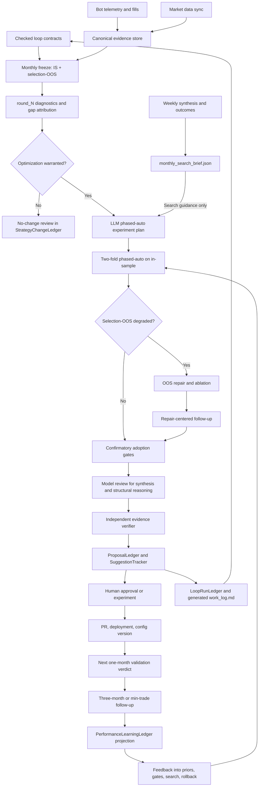
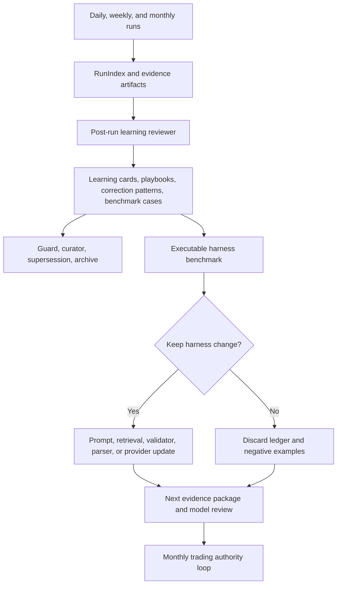

# Trading Assistant Workflow And Learning Loop Target State

Date: 2026-05-11
Last updated: 2026-07-01

## 1. Purpose

This report replaces the working notes archived at
`docs/audits/2026-05-10-workflow-learning-loop-report.md` with a cleaner
target-state plan.

It describes:

- the current state of `trading_assistant`;
- the main weaknesses that limit its ability to improve trading performance;
- the optimal state for proposing meaningful high-value improvements grounded
  in evidence;
- the loop-engineering operating substrate now adopted around the evidence
  loop: checked loop contracts, generated loop activity projection, artifact
  authority, independent verification, source-backed performance-learning
  projection, and one-command guardrail checks;
- the implementation steps required to reach that state;
- the final monorepo package structure that keeps control, data, and backtest
  boundaries explicit while avoiding hidden in-process coupling.
- the post-refactor ownership and readiness split: module architecture can be
  complete while operational approval readiness still depends on live metadata,
  scheduled shadow evidence, and an `approval_ready` bridge.

The end goal is not more reporting for its own sake. The end goal is a
repeatable evidence loop that identifies strategy weaknesses, proposes
high-value changes, validates them with realistic replay, routes them through
approval, measures deployed results, and uses those outcomes to make future
candidate generation and validation better over time.

## 2. Executive Summary

`trading_assistant` has the right broad architecture: bots emit structured
events, the orchestrator curates evidence, deterministic systems detect known
problems, agents synthesize evidence, proposals are tracked, risky changes
require approval, and outcomes feed later context. The June 30 / July 1
architecture work deepened the main ownership modules around that target:
control-plane runtime assembly, loop handlers, prompt evidence, detector
catalog, data slice product, monthly artifact contract, and backtest monthly
execution now have named owners.

The remaining problem is no longer the module map. It is the readiness gap
between a shadow-ready validation spine and production approval authority:

- legacy WFO remains an event-level screening or rejection tool, not full
  strategy replay over market data;
- `AutoOutcomeMeasurer` remains useful for early warning and context, but
  material strategy outcomes must be finalized by monthly validation;
- monthly validation, phased-auto, selection-OOS repair, model review, and
  approval packet generation exist, but adoption stays blocked until live
  runtime metadata, scheduled shadow evidence, and at least one
  `approval_ready` strategy bridge exist;
- weekly evidence now has a bounded monthly-search-brief contract, but it must
  remain advisory and can steer ordering only, not sequence, triggers, gates, or
  adoption;
- `StrategyChangeLedger`, outcome priors, performance-learning projection, and
  authoritative data bundles exist at the module level, but real monthly
  outcomes and live deployment evidence still need to accumulate;
- two cleanup tracks remain architectural polish rather than target blockers:
  detector modules still retain `StrategyEngine` compatibility wrappers, and
  data normalization remains a large command surface while slice path/index and
  authority ownership live under `trading_assistant_data/slices/`.

The optimal direction is to replace lightweight validation with a monthly
full-fidelity validation and repair loop:

1. Sync canonical market data and bot telemetry.
2. Freeze all data before the latest completed month as in-sample and the latest
   completed month as selection-OOS.
3. Run full end-of-round diagnostics on the latest `round_N` strategy and
   portfolio configs.
4. Build a bounded monthly search brief from weekly evidence and prior outcomes.
5. Have the LLM turn diagnostics into a structured phased-auto experiment plan.
6. Run two-fold phased-auto optimization on the in-sample window.
7. If latest-month selection-OOS materially trails in-sample/fold performance,
   run granular OOS repair.
8. Run repair-centered confirmatory follow-up around the OOS-repair recommended
   candidate and adopt the best backtest candidate as `round_N+1` optimized
   configs.
9. Use the resolved `immutable_score_profiles_v1` score profile consistently
   for monthly/phased-auto candidate ranking, while keeping `objective_weights_v1`
   as a legacy helper score for learning snapshots and local triage.
10. Route selected candidates through model review, validation, and human
   approval.
11. Track accepted changes in `StrategyChangeLedger`.
12. Use the next completed month after approval/deployment as the primary clean
    deployed verdict.
13. Confirm persistence with a three-month or minimum-trade-count follow-up.
14. Feed outcomes directly into future candidate generation, gates, priors, and
    rollback decisions.

## 3. Current State

### 3.1 System Boundary

The assistant is a read-only local orchestrator. It does not place orders,
cancel orders, change live positions, or directly command bots.

It currently:

- polls or receives bot events;
- deduplicates events through deterministic event IDs;
- stores queue state in SQLite and evidence in JSONL/curated files;
- builds daily and weekly metrics;
- runs deterministic strategy detectors;
- invokes agent runtimes for daily, weekly, WFO, discovery, triage, and outcome
  reasoning workflows;
- parses structured suggestions from model output;
- validates suggestions against guardrails and historical track records;
- tracks proposals, suggestions, approvals, experiments, outcomes, forecasts,
  hypotheses, and calibration records;
- sends reports and approval requests through configured communication
  channels.

Trading behavior changes remain approval-gated. This is the correct safety
boundary and should remain in the optimal design.

### 3.2 Evidence Flow

Bots are expected to emit:

- trade events;
- missed opportunity events;
- daily snapshots;
- errors;
- health and process-quality events;
- filter decisions;
- order lifecycle events;
- slippage and cost context;
- parameter/config/deployment metadata;
- regime and signal context.

The current orchestrator can turn these into daily and weekly evidence. That is
useful for diagnosis and reporting. It is not enough by itself for
full-fidelity optimization, because alternate parameters may change which
signals, entries, exits, fills, and rejected orders would have existed.

### 3.3 Daily And Weekly Workflows

Daily workflow:

- builds curated daily metrics;
- produces bot and portfolio summaries;
- invokes an analysis agent where needed;
- reports PnL, drawdown, process failures, missed opportunities, execution
  issues, and significant anomalies.

Weekly workflow:

- aggregates recent daily evidence;
- runs deterministic `StrategyEngine` detectors;
- includes simulations and scorecards where available;
- invokes an agent for synthesis;
- records parsed suggestions through `SuggestionTracker` and `ProposalLedger`.

Weekly reporting can identify patterns, but weekly windows are often too short
for strategy-level optimization, especially for sparse strategies.

In the target design, daily and weekly workflows are primarily sensors and
diagnostic/reporting layers. They should maintain situational awareness, catch
process failures, surface hypotheses, update lightweight context, and flag
issues for urgent review or the next monthly validation cycle. They should not
be the authoritative mechanism for approving material strategy improvements.

### 3.4 Current WFO

Legacy WFO is retained as a screening and compatibility path. The historical
implementation lives in `skills/run_wfo.py`, while runtime dispatch, loop
modules, and action handlers own current scheduling and invocation surfaces.
It is no longer described as an authoritative handler-method path.

Current characteristics:

- scheduled weekly by default;
- uses `data/wfo_configs/<bot>.yaml` if present;
- defaults to anchored WFO with 180 in-sample days, 30 out-of-sample days,
  30-day step, and 6 minimum folds;
- default optimization metric is Calmar with max drawdown as secondary
  constraint;
- operates on curated trade and missed-opportunity records;
- uses simplified replay rather than full market-data strategy replay.

This is useful as a screening or rejection tool. It is not reliable enough to
approve production parameter changes on its own.

### 3.5 Current Objective And Score Authority

The objective should not be reinvented, but the authority layers are now split
deliberately.

The prompt-level policy source is `memory/policies/v1/soul.md`. It frames human
utility as flexible bands: return/net alpha, edge/profit quality, opportunity
coverage, capture/signal quality, risk/drawdown control, and process/stability.
Those bands guide model reasoning and human communication. They are not a fixed
candidate-ranking formula.

The legacy helper score is `schemas/objective_weights.py`, versioned as
`objective_weights_v1`. It remains stable for daily/weekly learning snapshots
and local parameter-search triage so historical learning-ledger scores stay
comparable. Changing those constants would require an explicit
`objective_weights_v2` migration and rebaseline.

The binding monthly/phased-auto objective is the strategy-family immutable
profile registry in `trading_assistant_backtest.scoring.immutable`, emitted as
`effective_objective_version=immutable_score_profiles_v1`. Each replay-backed
candidate should preserve `objective_profile_id`, `score_component_cap`,
`immutable_score`, selected components, hard-reject state, and rejection
reasons. Profiles are shared by strategy family or portfolio, with small
strategy overlays where the reference scoring contracts require them.

Current WFO remains single-metric by configuration and is useful only as a
screening or rejection tool. The monthly framework should use immutable score
profiles for candidate selection and comparison, with hard gates for drawdown,
trade count, costs, OOS degradation, and data sufficiency.

### 3.6 Current Proposal Tracking

Existing tracking:

- `SuggestionTracker`: lifecycle for actionable suggestions;
- `ProposalLedger`: append-only proposal/evaluation/outcome provenance;
- `StrategyChangeLedger`: strategy-level changelog for monthly reviews,
  proposed changes, deployments, monthly verdicts, follow-ups, and rollbacks;
- approval records, deployment records, forecast records, hypotheses,
  experiments, and outcome files.

This is now strong at the module level. The remaining work is operational:
backfill older approvals where useful, keep new monthly records linked to
proposal, approval, PR, deployment, config diff, outcome, and rollback status,
and let real monthly verdicts accumulate so downstream priors become
load-bearing.

### 3.7 Current Outcome Measurement

`skills/auto_outcome_measurer.py` is wired through runtime scheduled callbacks
and scheduler jobs, not directly owned by the FastAPI app factory. It is
scheduled as `outcome_measurement` on Sunday at 10:00 UTC by default.

It:

- scans `DEPLOYED` suggestions;
- skips already measured suggestions;
- anchors on `deployed_at`;
- tries 7, 14, and 30 calendar-day before/after windows;
- uses curated daily summaries and regime files;
- writes outcome records;
- marks lightweight suggestions as measured when they do not require monthly
  outcome authority;
- can trigger model-based outcome reasoning afterward.

Weakness: this is a one-shot lightweight lifecycle mechanism. If a 7-day result
is available first, a suggestion can be marked `MEASURED` before 14-day or
30-day evidence exists. Even the 30-day view is daily-summary based, not
full-fidelity replay.

For material strategy/config changes, this should be superseded by monthly
full-fidelity validation. The existing measurer can remain only as early
warning, operational monitoring, and prompt context.

### 3.8 Current Feedback Loop

Today, feedback mostly influences:

- future prompt context through `ContextBuilder`;
- category scorecards through `SuggestionScorer`;
- recalibration through `RetrospectiveBuilder` and `LearningCycle`;
- confidence suppression in `StrategyEngine` and `ResponseValidator`;
- outcome reasoning records;
- provider routing, playbooks, and learning ledger entries.

This is useful, but it mostly changes context and confidence. It does not yet
directly control future candidate-generation priors, search allocation,
conditional OOS-repair priority, acceptance gates, rollback priority, or
phased-auto search order.
The target state should not let weekly analysis directly create approval-ready
monthly candidates; that would add noise. Instead, weekly analysis should
produce bounded search-prior guidance that the monthly planner and runners may
use to change experiment emphasis, phase order, seed neighborhoods, negative
priors, and conditional repair-ablation order while replay gates remain
authoritative.

### 3.9 Current Loop-Engineering Operating Substrate

The repo has now adopted the strongest practical parts of the loop-engineering
framework as an operating layer around the existing trading-specific loop. This
does not add live-trading autonomy. It makes recurring loops more legible,
checkable, resumable, and harder to misrepresent.

Current implemented surfaces:

- `packages/trading_assistant/memory/loops/*.md` defines checked contracts for
  recurring loops, including purpose, cadence, authority boundaries, inputs,
  outputs, required checks, failure modes, and stopping criteria.
- `LoopContractStore` and `tools/check_loop_contracts.py` compare contracts
  against scheduler truth and high-risk authority rules.
- `loop_run_ledger.jsonl` and generated `memory/work_log.md` project completed
  scheduled activity from `ScheduledRunStore`, run metadata, monthly artifacts,
  task IDs, proposal IDs, provider/model, cost, blockers, and evidence links.
- `performance_learning_ledger.jsonl` projects source-backed strategy and
  portfolio learning records from proposal, strategy-change, portfolio-outcome,
  loop-run, monthly artifact, search-brief, and outcome-prior sources. It keeps
  proposal/evaluation/outcome stages separate, preserves stable source lineage,
  and exposes bounded relevance-scoped summaries to `ContextBuilder`.
- `ArtifactAuthorityRegistry` classifies binding, approval-gate, advisory,
  generated, diagnostics-only, and human-owned artifacts so approval-facing
  logic can ask whether an artifact may satisfy a gate.
- `MonthlyArtifactContract` is the control-plane owner for monthly artifact
  loading, scope checks, containment checks, approval-facing artifact views, and
  verifier input assembly. The backtest workspace still emits artifacts through
  manifests and `artifact_index.json`; it does not import control-plane code.
- `MonthlyEvidenceVerifier` performs a read-only second check after model-review
  validation and deterministic candidate gates, suppressing approval when
  packets overclaim evidence, cite unsupported paths, or use advisory,
  diagnostics-only, generated, or human-owned artifacts as actionable support.
- `tools/run_workspace_checks.py` exposes loop-focused commands:
  `loop-contracts`, `loop-ledger`, `performance-learning-ledger`,
  `monthly-verifier`, `monthly-shadow-smoke`, and `approval-packet-smoke`.

This substrate should remain a projection and guardrail layer. Lifecycle truth
stays in `ScheduledRunStore`, task truth in `TaskRegistry`, run truth in
RunIndex and run folders, monthly artifact truth in the backtest artifact index
as interpreted by `MonthlyArtifactContract`, approval evidence truth in approval
packets plus verifier artifacts, and trading authority in replay-backed monthly
validation plus human approval.

### 3.10 Architecture Ownership And Readiness Axis

The post-refactor module architecture is not the same as production readiness.
`docs/architecture/optimal-ownership-map-2026-07-01.md` records the current
owner modules for runtime assembly, loop handlers, prompt evidence, detector
behavior, monthly artifacts, artifact authority, data slices, source refresh,
backtest monthly execution, and architecture enforcement.

That ownership map should be read on two axes:

- module architecture: the deep modules exist, are tested, and preserve the
  three-workspace manifest/artifact boundary;
- operational readiness: live bots still need to emit runtime/VPS deployment
  metadata, scheduled monthly shadow runs need to accumulate, and at least one
  strategy bridge must be promoted from `shadow_validated` to `approval_ready`
  before approval-gated adoption is allowed.

This distinction is load-bearing. A checked-off architecture plan means the
codebase has the right owners and guardrails. It does not mean the system can
adopt a live trading change until the operational readiness gates also pass.

## 4. Main Improvements Required And Weaknesses Addressed

The required improvements are not isolated features. They are the changes
needed to turn the current reporting and screening loop into an evidence-backed
strategy improvement loop.

| Improvement required | Weakness it addresses | Intended effect |
|---|---|---|
| Hybrid deterministic + model design | Deterministic-only suggestions can miss structural mechanisms; model-only suggestions can be plausible but unsupported. | Keep deterministic evidence, scoring, safety, and gates in control, while using models for synthesis, structural reasoning, hypothesis generation, candidate review, and explanation. |
| Monthly full-fidelity validation and optimizer workflow | Current WFO is event-level replay and cannot prove alternate parameters would have produced better live trades. | Replace current WFO as the authoritative strategy-improvement path; run full diagnostics on `round_N`, optimize in-sample, use latest-month selection-OOS for candidate selection/repair, and adopt `round_N+1` only after evidence gates. |
| Shared phased-auto + OOS-repair framework | Current parameter search and WFO are too narrow, too local, and weak at diagnosing OOS failure modes. | Use diagnostics-driven two-fold phased-auto as the monthly optimizer; use OOS repair afterward for targeted attribution, accepted-mutation ablation, perturbation, rollback, and targeted additions when selection-OOS underperforms. |
| Weekly-to-monthly search brief | Weekly analysis can identify useful mechanisms, but using it directly as candidate authority would overfit noisy short windows. | Build a non-authoritative `monthly_search_brief.json` with evidence-linked experiment focus hints, phased-auto priorities, seed/rollback candidates, negative priors, conditional OOS-repair ablation priorities, and attribution; the planner/runners may use it only to steer ordering, not sequence, triggers, gates, or adoption. |
| Canonical market-data sync | Bot events alone cannot evaluate alternate signals, entries, exits, fills, or parameter paths. | Write versioned parquet and coverage manifests before monthly runs so replay can test what would have happened under alternate configs. |
| `StrategyChangeLedger` | Existing trackers do not provide a single strategy-level answer to what changed, why, when, and whether it worked. | Record proposal, approval, PR/commit, deployment, config diff, reason, evidence, outcome, follow-up verdict, and rollback status. |
| Replace authoritative `AutoOutcomeMeasurer` with monthly outcome validation | Current 7/14/30-day daily-summary before/after checks are too noisy and can prematurely mark suggestions as measured. | Use the next completed one-month full-fidelity validation as the primary deployed verdict, with later three-month or minimum-trade confirmation. |
| Operational feedback into optimization | Current feedback mostly affects future prompts and confidence scores. | Make outcomes directly influence candidate generation, search allocation, phased-auto order, OOS-repair focus, acceptance gates, negative priors, rollback priority, and structural proposal prompts. |
| Enforced attribution and config lineage | Before/after measurement can misattribute unrelated code, config, market, or deployment changes. | Require strategy version, config version, deployment ID, commit SHA, proposal IDs, and change IDs across telemetry, validation, and outcomes. |
| Consistent use of the binding objective | Legacy helpers and prompt policy can drift from the monthly scorer, and current WFO can optimize a different single metric. | Use `immutable_score_profiles_v1` for monthly/phased-auto selection and comparison; keep `objective_weights_v1` as a stable helper score; preserve profile metadata in artifacts and approval packets; apply hard gates for drawdown, trade count, costs, OOS degradation, and data sufficiency. |
| Data-quality and replay parity gates | Optimization can run on incomplete, misaligned, or non-representative data. | Block monthly verdicts and candidate approval unless coverage, missing-bar, session, fee/slippage, feature parity, and replay/live parity checks pass. |
| Structured model outputs and approval gates | Structural proposals can become vague or difficult to validate. | Require machine-readable proposals with evidence paths, risk classification, acceptance criteria, rollback plans, and manual approval for trading behavior changes. |
| Loop-engineering operating substrate | Recurring-loop purpose, authority, run history, and artifact authority can drift across code, docs, memory, and generated artifacts. | Use checked loop contracts, generated work-log projection, artifact authority registry, independent evidence verifier, and one-command loop checks to keep the monthly evidence loop legible and mechanically bounded. |
| Source-backed performance-learning projection | Outcome lessons can stay scattered across proposals, change ledgers, monthly artifacts, portfolio outcomes, and priors. | Project a compact evidence-memory ledger that links strategy and portfolio decisions to expected-versus-realized after-cost deltas, cadence authority, source records, weekly attribution, and relevance-scoped prompt summaries without becoming approval authority. |
| Persistence and rollback policy | Negative or inconclusive outcomes may not route to clear action. | Define keep, watch, rollback, quarantine, and repair thresholds, and prevent one-month positives from becoming strong priors until confirmed. |
| Harness and memory meta-learning | Prompt, retrieval, validator, provider, and generated-memory changes can otherwise be accepted by intuition rather than measured decision quality. | Use executable benchmarks, post-run learning review, guarded playbooks, focused recall, and keep/discard ledgers to improve the analysis harness without changing trading authority. |

## 5. Optimal State

### 5.1 Target Operating Model



The system should become a monthly evidence machine:

- data is synchronized and audited before optimization;
- `round_N` configs receive full diagnostics before optimization;
- phased-auto is driven by diagnosed weaknesses, not generic parameter searching;
- OOS repair is conditional on latest-month selection-OOS degradation;
- model calls happen after deterministic evidence assembly, not instead of it;
- loop contracts and artifact authority define what each recurring loop may
  read, write, summarize, or treat as binding;
- independent evidence verification runs before approval-facing monthly output
  can be routed;
- approvals remain manual for trading behavior changes;
- deployed results are measured by the same full-fidelity framework used for
  selection;
- the performance-learning projection joins strategy and portfolio outcomes to
  their source decisions, costs, artifacts, and relevance keys;
- feedback changes future search behavior, not just future prompts.

Cadence responsibilities:

- daily: monitoring, anomaly detection, process-quality checks, telemetry gaps,
  drawdown/error alerts, and lightweight hypotheses;
- weekly: synthesis, cross-bot pattern review, scorecard updates, context
  maintenance, proposal triage, and identification of candidates for monthly
  validation;
- weekly scope rotation: optimization focus rotates across active strategy and
  portfolio scopes before feeding the monthly search brief: week 1 covers
  `k_stock_trader` and trading stock, week 2 covers trading momentum, week 3
  covers trading swing, week 4 covers `crypto_trader`, then the cycle repeats
  from week 5 with `k_stock_trader` and trading stock. This rotation changes
  learning-loop review focus and search-prior emphasis, not approval authority;
- monthly: authoritative strategy learning and improvement through
  full-fidelity diagnostics, two-fold phased-auto, conditional OOS repair,
  approval-ready proposals, deployed-change measurement, and feedback into
  future candidate generation.

### 5.2 Hybrid Deterministic And Model Design

Deterministic systems should own:

- event routing;
- data validation;
- metric construction;
- replay execution;
- candidate enumeration;
- objective scoring;
- leakage checks;
- cost sensitivity;
- no-regression gates;
- duplicate/rejected-pattern checks;
- permission classification;
- approval routing;
- ledger writes.

Models should be called for:

- weekly synthesis across heterogeneous evidence;
- structural proposal generation where deterministic candidate builders are too
  narrow;
- candidate review after deterministic scoring;
- explanation of why validation failed;
- identifying plausible mechanisms behind under-trading, outlier losses,
  execution drift, filter overreach, or harmful accepted mutations;
- translating evidence into concise human-reviewable proposals.

Models should not:

- route raw events;
- bypass validation gates;
- approve trading behavior changes;
- write directly to bot production configs;
- invent unsupported proposals without evidence references.

Structural proposals sit between deterministic diagnosis and deterministic
validation. The model should be called only after monthly diagnostics,
phased-auto, OOS repair, or weekly synthesis has produced a structured
evidence package: failure mode, replay deltas, objective impact, rejected
candidates, prior mutation outcomes, affected strategy/config versions, and
data-quality status. The model then uses reasoning to identify mechanisms and
design-level fixes that deterministic candidate builders may not enumerate.

Expected structural proposal examples:

- split a strategy by regime, session, setup grade, or engine family;
- redesign an exit rule when payoff shape and exit tiers are mismatched;
- revise filter ordering when smoke tests show filter overreach;
- separate entry quality from execution/slippage bottlenecks;
- change coordination or cooldown logic when it suppresses high-value trades;
- quarantine or isolate an accepted mutation that interacts badly with another
  mutation.

The output should be a structured proposal, not a free-form recommendation. It
must include evidence paths, the hypothesized mechanism, affected strategy and
config scope, expected objective impact, risk classification, replay or
experiment plan, acceptance criteria, rollback plan, and whether it should be
routed to phased-auto, OOS repair, bounded experiment, or manual design review.

### 5.3 Monthly Validation And Optimization

The monthly loop should replace current WFO as the main strategy-improvement
workflow.

Windowing:

- in-sample window: all reliable data before the latest completed month, anchored
  and growing over time;
- selection-OOS window: the latest completed month, used for candidate
  selection and OOS repair after in-sample optimization;
- `round_N` diagnostics: full end-of-round diagnostics on the latest optimized
  strategy and portfolio configs before any candidate search;
- internal validation: two purged folds inside the in-sample window, with embargo
  around fold boundaries;
- trailing 3-6 month context: used when the latest month is sparse;
- deployed verdict: the next completed month after approval/deployment, because
  the selection-OOS month is no longer a clean holdout once it influences
  selection or repair;
- follow-up: later three-month or minimum-trade-count confirmation.

The latest month should not grow indefinitely for candidate selection, because
that dilutes recent failure modes. In-sample should not be fixed at 180 days
unless that is all the reliable data available.

### 5.4 Monthly Optimization Sequence

Monthly optimization should be deterministic in its gates, with LLM reasoning
used to design and review experiments after evidence has been assembled.

Weekly analysis may provide search-priority hints, but it should not decide the
sequence, choose a mode, or trigger OOS repair. The hints belong in
`monthly_search_brief.json` with evidence paths, recency, sample-size context,
and a confidence cap. Monthly diagnostics, replay parity, data coverage, gap
attribution, fold scores, selection-OOS performance, and human override remain
decisive.

Preferred sequencing:

1. Run full end-of-round diagnostics on `round_N` strategy and portfolio configs
   over the in-sample window, with latest-month selection-OOS comparison kept
   separate.
2. Build or load the monthly search brief as advisory priors for the LLM plan
   and runner ordering.
3. Have the LLM turn diagnostics into a structured phased-auto plan covering
   signal extraction, discrimination against low-quality/negative signals,
   entries, added mechanisms, trade management, exits, structural candidates,
   experiment order, immutable score scaling, and overfit risks.
4. Run two-fold phased-auto on in-sample data from the latest optimized configs.
5. If latest-month selection-OOS materially trails the in-sample/fold profile,
   run OOS repair using all cumulative accepted mutations, granular ablations,
   local perturbations, and targeted additions from OOS weakness analysis.
6. If OOS repair ran, run repair-centered confirmatory follow-up around the
   repair-recommended candidate before comparing against the incumbent,
   phased-auto winner, rollback candidates, and targeted additions under the
   same resolved immutable score profile. If no OOS repair ran, confirm the
   phased-auto winner instead.
7. Adopt the best backtest candidate as `round_N+1`, update the rounds manifest,
   save full end-of-round diagnostics, and verify live/backtest parity alignment
   before approval routing.

OOS repair should be used when:

- latest-month selection-OOS materially underperformed in-sample/fold
  expectation;
- accepted mutations from any previous round may have caused weakness;
- under-trading, outlier losses, filter overreach, poor discrimination,
  execution drift, or regime-specific edge cases need attribution;
- granular ablation, perturbation, rollback, or targeted additions can improve
  OOS without materially degrading in-sample/fold quality.

Phased-auto should be used when:

- the strategy has a mature plugin and known mutation phases;
- enough market data and trade count exist;
- incumbent replay parity is acceptable;
- broad candidate search is justified by diagnostics;
- prior outcomes identify productive mutation families.

### 5.4.1 Weekly-To-Monthly Search Priors

The weekly layer should influence monthly optimization only through a bounded
search brief. It should answer "what should the LLM planner and monthly runners
inspect first?" not "what sequence should run?" or "what should be approved?"

`monthly_search_brief.json` should include:

- run month, bot id, strategy id, and evidence paths;
- experiment focus hints for the LLM phased-auto plan;
- phased-auto priority families and phase-order hints;
- prioritized mutation families such as exits, filters, sizing, time-of-day,
  regime gates, and cost controls;
- seed candidates or parameter neighborhoods to test first;
- conditional OOS-repair ablation priorities, used only if the monthly OOS
  repair trigger fires;
- rollback candidates when accepted mutations from any prior round plausibly
  caused degradation;
- negative priors and families requiring stronger evidence;
- confidence cap and recency/sample-size metadata;
- `source_weekly_signal_ids` so later monthly outcomes can score whether the
  weekly signal was useful.

Guardrails:

- the brief can reorder phased-auto search, seed candidate neighborhoods, add
  negative priors, or rank OOS-repair ablations after repair is triggered;
- the brief cannot change the monthly sequence, choose a mode, or trigger OOS
  repair;
- the brief cannot satisfy improvement, calibration, drawdown, cost, outlier,
  model-review, approval-payload, or human-approval gates;
- one-week signals should stay low-confidence unless repeated or supported by
  monthly outcomes;
- runners must preserve attribution from weekly signal to monthly candidate and
  outcome.

### 5.5 Shared Backtesting Framework

The shared framework should draw from the reference patterns in
`_references/trading/`:

- `backtests/shared/auto`;
- `backtests/shared/smoke/latest_oos_smoke.py`;
- `backtests/shared/validation/oos_validation.py`;
- `backtests/swing/auto/oos_repair_diagnostics.py`;
- `backtests/swing/auto/incumbent_repair.py`;
- moved research scripts under `backtests/scripts`.

The shared runner should own:

- cadence;
- data coverage checks;
- frozen run manifests;
- phase state;
- greedy orchestration;
- OOS-repair orchestration;
- scoring and gate protocol;
- artifact layout;
- provenance;
- report generation;
- approval routing.

Execution boundary:

- `trading_assistant` should remain the orchestrator and evidence ledger, not
  the host of every strategy backtest engine;
- full-fidelity engines should live in the versioned
  `trading_assistant_backtest` package workspace, not inside the control plane;
- the current supported checkout is the final `packages/` monorepo shape;
  `packages/trading_assistant_backtest/` is the backtest package workspace with
  `src/trading_assistant_backtest/`;
- monthly runs should invoke the backtest package through a stable CLI or API
  with a frozen manifest, then ingest standard artifacts;
- replay and optimization should not call live VPS bots; VPSes supply telemetry,
  production metadata, and deployment/config identifiers only;
- strategies without a replay plugin and parity audit should remain
  reporting/diagnostics-only, not optimization candidates.

Package/workspace layout boundary:

```text
trading_assistant_agent/
  README.md
  docs/
  artifacts/
  tools/
  _references/
  packages/
    trading_assistant/
      pyproject.toml
      src/trading_assistant/
      tests/
    trading_assistant_data/
      pyproject.toml
      src/trading_assistant_data/
      tests/
      data/
    trading_assistant_backtest/
      pyproject.toml
      src/trading_assistant_backtest/
      tests/
      contracts/
      artifacts/
```

- `packages/trading_assistant` is the control-plane package workspace.
- `packages/trading_assistant_data` is the canonical data-product package
  workspace.
- `packages/trading_assistant_backtest` is the replay and optimizer evidence
  package workspace.
- The package workspaces may be independently versioned, released, or
  submoduled later, but the normal local development shape is the `packages/`
  monorepo layout.
- Cross-workspace runtime communication should remain file/manifest/artifact
  based. Direct imports across `trading_assistant`,
  `trading_assistant_data`, and `trading_assistant_backtest` should be blocked
  by tooling except for explicitly documented migration shims.

Three-role structural boundary:

- `trading_assistant` is the control plane. It freezes windows, data manifests,
  legacy objective version, immutable objective/profile metadata, `round_N`
  configs, code SHAs, run ids, approval state, and ledgers.
- `trading_assistant_data` is the data product. It owns canonical market data,
  requirements, calendars, checksums, bundle manifests, source-refresh logic,
  and data-reproduction evidence.
- `trading_assistant_backtest` is the experiment lab. It runs diagnostics,
  phased-auto, OOS repair, scoring, artifact emission, and replay adapters.
- The actual trading repo is production truth for strategy behavior. Structural
  phased-auto candidates must be implemented against production-style strategy
  code first, or against a shared strategy package imported by production.
- The backtest repo may import the live strategy implementation directly, or it
  may use an adapter that proves decision-level equivalence. PnL similarity is
  not enough.
- Decision-level parity must cover signals, filters, entries, exits, stops,
  sizing, and risk blocks before a structural candidate can enter scoring or
  approval packets.

Market-data boundary:

- production market data should live under the canonical data product's
  configured data root, not inside `trading_assistant` or
  `trading_assistant_backtest` as control/backtest package content;
- `trading_assistant_data` should own source refresh, normalization, calendars,
  checksums, slice manifests, bundle manifests, and data-reproduction reports;
- `trading_assistant` should own data-sync scheduling requests, freshness gates,
  run manifests, and decision records;
- `trading_assistant_backtest` should consume manifest-backed data as replay
  input and record exactly which data version was used;
- package workspaces should use explicit paths such as `DATA_REPO_PATH`,
  `MARKET_DATA_ROOT`, `BACKTEST_REPO_PATH`, and `BACKTEST_ARTIFACT_ROOT`;
- large parquet, tick archives, feature caches, and run artifacts should remain
  outside git, with reproducibility provided by checksums, manifests, config
  versions, and code SHAs.

Strategy plugins should own:

- strategy-specific data loading;
- replay implementation;
- mutation semantics;
- candidate generation;
- phase definitions;
- strategy-specific gates;
- diagnostics;
- metric extraction.

Structural candidates inside phased-auto:

- phased-auto should treat new signals/features, entry/exit mechanisms,
  trade-management logic, and portfolio interaction logic as first-class
  candidates, not as a separate workflow;
- structural candidates require isolated worktrees or branches for the actual
  trading repo and `packages/trading_assistant_backtest`;
- each structural candidate must record live repo patch, backtest adapter patch,
  config/schema patch when applicable, tests, rollback plan, and code SHAs;
- structural candidates must pass unit tests, strategy decision tests, replay
  adapter tests, and decision-level live/backtest parity before optimization
  tunes config neighborhoods around them;
- config-only candidates and structural+config candidates compete under the same
  objective and monthly gates, but structural candidates carry stronger lineage
  and parity requirements.

Symphony-style candidate orchestration:

- Port Symphony's workspace and attempt discipline, not its issue-tracker daemon.
  The monthly optimizer should create deterministic per-candidate workspaces for
  structural candidates and long OOS-repair attempts.
- Candidate workspace keys must be sanitized, resolved workspace paths must stay
  under the configured workspace root, and all agent/subprocess work must run
  with `cwd` equal to the candidate workspace.
- A repo-owned workflow contract, for example `PHASED_AUTO_WORKFLOW.md` or
  `MONTHLY_OPTIMIZER_WORKFLOW.md` in `trading_assistant_backtest`, should define
  runner command, hooks, timeouts, `max_workers`, score-component cap, parity
  requirements, artifact names, and prompt template. Deterministic gates and
  approval policy remain in code and policy memory.
- Candidate attempts should have explicit durable state: unclaimed, claimed,
  running, retry queued, released, succeeded, failed, timed out, stalled, and
  canceled by reconciliation.
- Retry/backoff, stall detection, and reconciliation should cancel or release
  attempts when manifests, repo SHAs, data manifests, approval state, or
  candidate eligibility drift.
- Structured observability should include run id, candidate id, workspace,
  attempt state, subprocess pid, phase, timeout/stall status, retry state,
  artifact paths, token usage when agent-driven, and parity status.
- Do not port Linear-specific tracker logic, ticket writes, high-trust
  auto-approval, or Symphony's "no durable state required" assumption. Monthly
  optimizer state should remain auditable and approval-gated.

Reference example: the NQDTC path in
`backtests/swing/auto/oos_repair_diagnostics.py` imports the actual strategy
engine, config, mutation helpers, data loader, and replay kwargs. The target
shape should preserve that full-fidelity strategy ownership, but expose it
through a shared manifest-driven command such as
`python -m backtests.shared.monthly_repair --manifest <run_manifest.json>`.
The manifest should identify the strategy, production config, canonical parquet
coverage, legacy objective version, accepted mutation ledger, run window, output
folder, backtest repo commit SHA, live trading repo commit SHA, and structural
patch artifacts when applicable. Replay-backed outputs should additionally
record the effective immutable objective version and profile metadata. Standard
outputs should include
`coverage_manifest.json`, `incumbent_validation.json`,
`candidate_results.jsonl`, `selected_candidates.json`,
`rejected_candidates.jsonl`, `decision_parity_report.json` for structural
candidates, and a concise monthly report.

### 5.6 Immutable Score Profiles And Gates

Monthly/phased-auto selection and candidate comparison should use the resolved
`immutable_score_profiles_v1` profile for the strategy, family, or portfolio.
The profile is the binding score contract for replay-backed monthly artifacts.
It should usually include no more than seven selected components, normalized to
the profile scale, with hard rejects applied before candidate adoption.

Common profile dimensions include:

- return / net alpha;
- edge, profit factor, expectancy, or win/R quality;
- opportunity coverage and trade frequency;
- capture, signal, selection, or execution quality;
- drawdown/risk resilience and risk efficiency;
- stability, process, rule efficiency, or strategy balance where available.

Every replay-backed candidate and incumbent summary should preserve
`effective_objective_version`, `objective_profile_id`, `score_component_cap`,
compact `immutable_score`, selected components, hard-reject status, and
rejection reasons. `objective_weights_v1` remains a legacy/helper composite for
daily/weekly learning snapshots and local triage; it should not be used to
recompute monthly candidate ranking.

Hard gates should include:

- no material in-sample deterioration;
- latest-month OOS improvement;
- positive support across purged folds;
- sufficient trade count;
- realistic fees, slippage, spread, and funding;
- no large increase in max drawdown;
- no large increase in concentrated loss days;
- no dependence on one or two outlier wins;
- no improvement only at zero or unrealistic cost;
- no breakage of portfolio, symbol, leverage, or heat-cap constraints.

Trade frequency matters both as an immutable profile component for strategies
where opportunity coverage is part of the reference score and as an
under-trading/viability gate. It should never override hard rejects, drawdown
limits, realistic costs, or OOS degradation gates.

### 5.7 Proposal And Change Tracking

The optimal tracking model should use three ledgers:

- `ProposalLedger`: exhaustive candidate, evaluation, rejection, experiment,
  approval, deployment, and outcome provenance;
- `SuggestionTracker`: actionable suggestion lifecycle and approval-facing
  status;
- `StrategyChangeLedger`: canonical strategy-level changelog.

`StrategyChangeLedger` should record:

- bot ID and strategy ID;
- record type: monthly review, proposed change, deployed change, rollback, or
  no-change decision;
- prior config version and new config version;
- mutation diff;
- source proposal IDs and suggestion IDs;
- approval request ID;
- PR URL and commit SHA;
- deployment ID and deployed timestamp;
- backtest, OOS-repair, phased-auto, experiment, and live evidence paths;
- decision reason;
- one-month validation verdict;
- three-month or minimum-trade-count follow-up verdict;
- rollback/quarantine/repair status.

The broad candidate set should stay in `ProposalLedger`. Only selected
changes, deployed changes, rollbacks, and explicit no-change decisions should
enter `StrategyChangeLedger`.

### 5.8 Outcome Measurement

The authoritative strategy outcome mechanism should be the monthly validation
loop, not `AutoOutcomeMeasurer`.

Outcome design:

- primary verdict: next completed one-month validation window after deployment;
- confirmation: three-month or minimum-trade-count follow-up;
- early warning: existing weekly `AutoOutcomeMeasurer`, retained only for
  operational alerts and prompt context;
- persistence: write verdicts to `StrategyChangeLedger`, `ProposalLedger`, and
  `SuggestionTracker`;
- attribution: link verdicts to config version, deployment ID, proposal IDs,
  commit SHA, and mutation diff.

The one-month verdict should answer:

- did live behavior match the expected backtest without relying on the
  selection-OOS month as a clean verdict?
- was under-trading caused by filters, regime, data gaps, config changes, or
  market opportunity?
- were losses caused by a few edge cases, broad degradation, or execution drift?
- did accepted mutations help, harm, or fail to matter?
- should the change be kept, rolled back, repaired, quarantined, or watched?

### 5.9 Feedback Into Future Decisions

Feedback should become operational.

The compact bridge is `performance_learning_ledger.jsonl`: a source-backed
evidence-memory projection, not a new authority. It should refresh from current
proposal, change, portfolio-outcome, monthly artifact, search-brief, and
outcome-prior sources; fail strict checks on malformed or stale source rows;
and expose only bounded, bot-relevant strategy and portfolio summaries to prompt
packages.

Positive outcomes should:

- raise priors for specific mutation families;
- increase search allocation toward similar candidates;
- loosen only evidence-based exploration limits, never safety gates;
- strengthen model prompt context with concrete mechanisms.

Negative outcomes should:

- create negative priors for failed mutation families;
- force stronger evidence for repeated categories;
- trigger rollback or quarantine thresholds;
- focus OOS repair on the failed mechanism;
- reduce model confidence in similar structural proposals.

In phased-auto:

- phase ordering should favor historically productive candidate families;
- weak families should be skipped or require stronger gates;
- prior successful perturbation ranges should seed search neighborhoods;
- bounded weekly search-brief signals may adjust phase order or seed
  neighborhoods, but they do not decide that phased-auto should run and only
  monthly replay can validate the result.

In OOS repair:

- ablation should cover all cumulative accepted mutations, starting with the
  most historically suspect;
- perturbation should target the diagnosed failure mode;
- rollback candidates should be evaluated before targeted additions;
- weekly rollback hints may rank what to test first only after the monthly
  selection-OOS repair trigger fires, and causality must be proven by
  full-fidelity replay against the frozen incumbent.

In structural proposals:

- models should use replay-attributed failure modes and prior mutation outcomes;
- proposals should cite evidence paths and rejected alternatives;
- speculative ideas should remain hypotheses until tested.

### 5.10 Harness And Memory Meta-Learning Layer

If the Hermes/AutoAgent leverage recommendations are implemented optimally, the
target state becomes a two-layer learning system:

- trading authority layer: monthly full-fidelity diagnostics, phased-auto,
  OOS repair, deterministic gates, manual approval, deployed outcome
  measurement, and outcome priors;
- harness meta-learning layer: measured improvement of prompts, retrieval,
  validators, parsers, generated playbooks, learning cards, provider routing,
  and model-review quality.

The second layer must improve the first without replacing it. It can change
how evidence is retrieved, summarized, validated, routed, and presented. It
cannot approve trading changes, weaken gates, edit policy memory, command bots,
or treat generated memory as authority.

The main allowed bridge from weekly/harness learning into trading authority is
bounded search guidance. Advisory memory, hypotheses, and structural experiment
records may be summarized into `monthly_search_brief.json`; the monthly runner
may use that brief to prioritize what it tests, but the brief cannot alter the
fixed monthly sequence, trigger OOS repair, or satisfy gates. Every candidate
still needs full-fidelity evidence and human approval.

The evolved target memory model should have five layers:

1. Policy memory: human-edited rules, objectives, permission gates, and
   governance constraints.
2. Evidence memory: monthly artifacts, ledgers, outcomes, priors, approvals,
   replay reports, benchmark results, and rejected candidates.
3. Advisory memory: learning cards and generated playbooks with provenance,
   usage, outcome attribution, supersession, quarantine, and archive/restore.
4. Raw recall: indexed run artifacts, session summaries, validator notes,
   model-review traces, and focused summaries of relevant prior runs.
5. Evaluation corpus: executable benchmark cases derived from failures,
   blocked proposals, negative outcomes, calibration misses, parser failures,
   and high-value successes.

The evolved target loop:



Executable harness benchmarks should evaluate analysis quality, not trading
rules directly. They should test whether a prompt, retrieval, validator,
parser, generated-memory, or provider-routing change improves:

- bad-proposal blocking;
- good-candidate preservation;
- evidence citation completeness;
- monthly-authority compliance;
- parse/schema success;
- confidence calibration;
- risk realism;
- contradiction handling when newer outcomes supersede older memories.

Hard failures should override score gains:

- approval bypass;
- direct live trading command;
- material strategy change without required evidence;
- hallucinated artifact path used as evidence;
- autonomous policy edit;
- acceptance despite deterministic gate failure.

Post-run learning review should be asynchronous and evidence-bounded. It may
create or update learning cards, generated playbooks, benchmark cases,
correction patterns, and quarantine metadata through guarded write paths. It
must be idempotent, auditable, and advisory.

Generated playbooks should become trading-specific procedural skills, but only
when evidence supports them. They need safety scanning, trigger conditions,
required evidence, investigation steps, expected outputs, failure modes,
usage/outcome attribution, curation, pinning, supersession, and recoverable
archival.

Provider routing should become outcome-aware and benchmark-aware. Quality,
calibration, parse reliability, evidence use, and governance compliance should
dominate cost and latency. Cost may break ties only after quality and safety
thresholds pass.

The evolved end state is therefore not only a better trading validation loop.
It is a system that improves the analysis harness that feeds that loop, while
keeping monthly evidence/replay validation as the sole authority for material
strategy changes.

### 5.11 Loop Contracts, Artifact Authority, Work-Log, And Learning Projection

The best loop-engineering adoption is an operating substrate, not a generic
agent framework. It should keep the current trading-specific authorities intact
while adding mechanical continuity and reviewability.

Target responsibilities:

- Loop contracts define each recurring loop's cadence, authority boundary,
  inputs, outputs, stopping criteria, and escalation path. They are checked
  against scheduler specs and generated skill indexes so prompt context cannot
  drift quietly from runtime truth.
- The loop-run ledger is a read-only projection over authoritative sources. It
  should never replace `ScheduledRunStore`, `TaskRegistry`, RunIndex,
  `ProposalLedger`, `StrategyChangeLedger`, or monthly artifact indexes. Its job
  is to preserve a compact activity feed with status, blockers, task/run/proposal
  IDs, artifacts, provider/model metadata, costs where available, and source
  records.
- `memory/work_log.md` is generated from the ledger for humans and future
  agents. It is recent context, not a source of truth.
- The performance-learning ledger is a second projection over authoritative
  decision/outcome sources. It links proposal, change, deployment, monthly
  verdict, portfolio, cost, and artifact metadata into compact expected-versus-
  realized learning records while keeping proposal, evaluation, deployment, and
  outcome stages separate. It may feed priors, search allocation, gate
  calibration, rollback context, and prompt summaries; it may not rewrite source
  ledgers, satisfy approval gates, or admit unrelated portfolio lessons into a
  bot-scoped context window.
- Artifact authority classifies whether an artifact is binding, eligible for an
  approval gate, advisory, generated, diagnostics-only, or human-owned. Advisory
  search briefs, diagnostics artifacts such as runner observability, generated
  model outputs, and human-owned policy memory may inform context but cannot
  serve as actionable approval support.
- The monthly artifact contract is the narrow approval-facing interface over
  monthly artifacts. It composes `BacktestArtifactIndex` and
  `ArtifactAuthorityRegistry` so path containment, artifact authority,
  selected/rejected candidate loading, approval evidence construction, and
  verifier input assembly do not drift across control-plane callers.
- The independent monthly evidence verifier is a read-only honesty check after
  deterministic validation. It checks packet scope, gate status, model-review
  validation, evidence existence, artifact authority, deployment-metadata
  overclaims, and lightweight-outcome misuse before a candidate can be routed to
  approval.
- Loop checks are executable context engineering. They should keep failing with
  explicit acceptance rows and remediation when schedule docs drift, contracts
  overclaim authority, work-log evidence is empty or placeholder-only, verifier
  boundaries weaken, or retired WFO wording becomes authoritative again.

This layer is intentionally conservative. It improves the evidence loop by
making state and authority visible; it does not create candidates, approve
changes, deploy code, edit policy memory, or mutate live bots.

## 6. Implementation Plan

### Phase 0: Architecture Decisions

Deliverables:

- write a short ADR that states current WFO and `AutoOutcomeMeasurer` are no
  longer authoritative for material strategy/config changes;
- define the monthly loop as the authoritative strategy validation and repair
  workflow;
- confirm `immutable_score_profiles_v1` as the canonical monthly/phased-auto
  selection and comparison objective, and `objective_weights_v1` as a legacy
  helper score only;
- define which workflows remain weekly and which become monthly;
- record that the `packages/` monorepo layout is now the supported checkout
  shape;
- confirm the backtest-engine boundary as the
  `packages/trading_assistant_backtest` package workspace, invoked through a
  stable CLI/API and configured by `BACKTEST_REPO_PATH`;
- confirm the canonical data boundary as the
  `packages/trading_assistant_data` package workspace, with authoritative data
  bundle manifests and configured data roots;
- decide the canonical data root and artifact root used by the package
  workspaces;
- define the manifest, CLI/API, artifact, and commit-SHA contract between
  `trading_assistant`, `trading_assistant_data`, and
  `trading_assistant_backtest`.
- adopt the loop-engineering operating substrate as an additive layer only:
  loop contracts, loop-run projection, generated work log, performance-learning
  projection, artifact authority, independent evidence verifier, and loop
  checks.

Acceptance criteria:

- the repo has one documented source of truth for the new loop;
- the repo has one documented source of truth for the final `packages/`
  structure;
- current WFO is labeled as screening/legacy unless upgraded;
- `AutoOutcomeMeasurer` is labeled early warning/context only;
- loop contracts and artifact authority are checked before prompt context or
  approval-facing evidence can rely on them;
- `trading_assistant` is explicitly responsible for orchestration, evidence
  ingestion, ledgers, approval routing, and feedback, not for reimplementing
  every strategy engine.

### Phase 1: Attribution And Telemetry Contract

Deliverables:

- enforce required fields for trades, missed opportunities, snapshots, order
  events, parameter changes, and deployment events;
- require `strategy_id`, `strategy_version`, `config_version`,
  `deployment_id`, `parameter_set_id`, `experiment_id`, `variant_id`, and
  `code_sha` where relevant;
- add compatibility tests for each bot event producer;
- add runtime alerts when required fields disappear;
- add schema versioning for bot telemetry.

Acceptance criteria:

- monthly validation can map every trade and missed opportunity to a strategy
  version and config version;
- outcome measurement can map each deployed change to proposal, approval, PR,
  commit, deployment, and rollback status;
- missing attribution blocks authoritative monthly verdicts.

### Phase 2: Canonical Market Data Sync

Deliverables:

- implement source-refresh and bundle-building jobs in
  `packages/trading_assistant_data`;
- schedule or request those jobs from the control plane without importing data
  package internals;
- store production market data in the configured data-product root, with large
  generated data handled by Git LFS or external storage policy rather than by
  the control/backtest package code;
- write versioned parquet for each market, symbol, timeframe, and data source;
- write coverage manifests with start/end timestamps, bar counts, missing bars,
  timezone/session metadata, checksum, and source version;
- include fees, slippage, spread, funding, and corporate-action or exchange
  adjustment metadata where relevant;
- allow bot-uploaded parquet only as fallback when the bot has the only
  reliable feed.

Acceptance criteria:

- monthly validation refuses to run without a valid coverage manifest;
- the manifest proves data reaches the latest completed month end;
- replay jobs can identify exactly which data version they used;
- backtest reproducibility depends on data manifest/checksum, config version,
  and code SHA, not on committing production market data to a repo.

### Phase 3: StrategyChangeLedger

Deliverables:

- add `schemas/strategy_change_ledger.py`;
- add `skills/strategy_change_ledger.py`;
- define JSONL or SQLite-backed storage under `memory/findings`;
- add methods to record monthly review, proposed change, deployed change,
  rollback, no-change decision, one-month verdict, and follow-up verdict;
- link records to `ProposalLedger`, `SuggestionTracker`, approvals, PRs, commits,
  deployments, and evidence paths;
- update context assembly so future prompts can include recent strategy changes.

Acceptance criteria:

- a reviewer can answer what changed, why, when, on which strategy, under which
  config, and whether it worked;
- monthly no-change decisions are recorded when evidence is insufficient;
- broad candidate noise remains in `ProposalLedger`, not `StrategyChangeLedger`.

### Phase 4: Replay Adapter And Parity Audit

Deliverables:

- define a strategy plugin protocol for full-fidelity replay;
- implement replay adapters for the first target strategy family;
- configure `BACKTEST_REPO_PATH` to point at
  `packages/trading_assistant_backtest` and record its commit SHA or package
  version in each run manifest;
- record the actual trading repo commit SHA for the live strategy code used as
  production truth;
- reproduce incumbent production config behavior over historical windows;
- compare replay results to live observed trades and fills;
- add a decision-level parity harness that can feed identical historical
  bars/events into live strategy logic and backtest replay logic;
- write parity reports with trade count, entry/exit match rate, PnL delta, cost
  delta, drawdown delta, signal/filter/entry/exit/stop/sizing/risk-block match
  rates, and missing explanation counts.

Acceptance criteria:

- monthly optimization is blocked unless incumbent replay parity is acceptable;
- known mismatches are explicit and quantified;
- the replay adapter can evaluate alternate parameters that change signal,
  filter, entry, exit, and sizing behavior;
- structural candidates are blocked unless the adapter imports live strategy
  logic or proves decision-level equivalence against the actual trading repo;
- strategies without a passing replay adapter remain reporting/diagnostics-only.

### Phase 5: Monthly Validation Orchestrator

Deliverables:

- add a monthly scheduled workflow after data sync;
- freeze run metadata: month, data versions, strategy versions, config versions,
  deployment IDs, legacy objective version, effective immutable objective
  version, objective profile id, and code SHA;
- freeze all reliable data before the latest completed month as in-sample and
  the latest completed month as selection-OOS;
- run full end-of-round diagnostics on the latest `round_N` strategy and
  portfolio configs over the in-sample window before generating candidates;
- produce gap attribution: under-trading, outlier losses, execution drift,
  regime mismatch, data gaps, harmful accepted mutations, or filter overreach;
- write a monthly validation report and machine-readable result.

Acceptance criteria:

- every strategy receives a keep, watch, repair, rollback, or insufficient-data
  status;
- insufficient data is not treated as success or failure;
- the latest completed month is clearly marked as selection-OOS and is not
  treated as a clean deployed verdict after it influences selection or repair.

### Phase 5B: Weekly-To-Monthly Search Brief

Deliverables:

- add `schemas/monthly_search_brief.py`;
- add `skills/monthly_search_brief_builder.py`;
- build the brief from weekly synthesis, detector findings, active hypotheses,
  structural experiment records, recent suggestion outcomes, monthly outcomes,
  outcome priors, and category recalibrations;
- include experiment focus hints, phased-auto priority families, phase-order
  hints, seed candidates, conditional OOS-repair ablation priorities, rollback
  candidates, negative priors, confidence caps, evidence paths, and
  `source_weekly_signal_ids`;
- attach the brief path to the monthly run manifest or adjacent monthly evidence
  bundle;
- require downstream candidate artifacts to preserve attribution back to the
  weekly signals that influenced planner or runner ordering.

Acceptance criteria:

- the brief is generated in report-only mode before runners consume it;
- one-week noisy signals are confidence-capped;
- the brief can change fixture planner emphasis, phased-auto order, seed
  neighborhoods, and conditional repair-ablation order, but cannot create an
  approval-ready candidate, alter the monthly sequence, or trigger OOS repair;
- attribution from weekly signal to monthly candidate and outcome is retained.

### Phase 6: Two-Fold Phased-Auto In-Sample Optimization

Deliverables:

- port or implement a shared phased-auto runner inspired by
  `_references/trading/backtests/shared/auto`;
- run after full `round_N` diagnostics and before any OOS repair;
- consume optional `monthly_search_brief.json` as planner-emphasis,
  phase-order, and seed-neighborhood guidance only;
- require a structured LLM experiment plan covering signal extraction,
  discrimination, entries, added mechanisms, trade management, exits,
  structural candidates, experiment order, immutable score-profile scaling, and
  overfit risks;
- use all data before the latest completed month as in-sample;
- build two purged in-sample folds with embargo, shifting fold boundaries each
  month as the data history grows;
- run with `max_workers=2` unless the run manifest lowers it;
- keep the immutable score to no more than seven components;
- define phase specs, candidate families, resolved immutable profile scoring,
  gates, and greedy selection;
- support strategy-specific plugins for candidate generation and replay;
- support a structural candidate lane inside phased-auto, not outside it:
  isolated worktrees/branches, live repo patch, backtest adapter patch,
  config/schema patch, tests, rollback plan, and code SHAs;
- add Symphony-style per-candidate workspace management and attempt tracking:
  sanitized workspace keys, path containment, cwd enforcement, durable attempt
  states, retry/backoff, stall detection, reconciliation cancellation, and
  structured observability;
- freeze the parsed monthly optimizer workflow contract path/version into the
  run manifest before dispatch;
- require structural candidates to pass unit tests, strategy decision tests, and
  decision-level live/backtest parity before fold scoring;
- tune config neighborhoods around passing structural candidates using the
  latest optimized configs as the baseline;
- add cost sensitivity, outlier-exclusion, drawdown, trade-count, and
  portfolio/synergy checks for shortlisted strategy candidates;
- keep the latest completed month outside phased-auto scoring.

Acceptance criteria:

- phased-auto only runs when data, plugin maturity, replay parity, and sample
  size are sufficient;
- selected candidates improve the resolved immutable score profile and pass
  no-regression gates on both in-sample folds;
- structural candidates are first-class phased-auto candidates, but cannot be
  shortlisted without patch lineage, rollback plan, and decision-level parity;
- candidate attempts are observable, retryable, and cancelable when manifest,
  repo SHA, data, or eligibility drift invalidates the run;
- the runner records all rejected candidates and rejection reasons;
- candidate artifacts preserve `effective_objective_version`,
  `objective_profile_id`, compact `immutable_score`, and any
  `source_weekly_signal_ids` that influenced planner emphasis, phase order, or
  seed-neighborhood order.

### Phase 7: Selection-OOS Repair And Confirmatory Adoption

Deliverables:

- integrate or port the shared smoke/OOS runner pattern from
  `backtests/shared/smoke/latest_oos_smoke.py`;
- consume `backtests/shared/validation/oos_validation.py` style latest-window
  resolution and coverage checks;
- trigger repair when latest-month selection-OOS materially trails the
  in-sample/fold profile;
- diagnose edge cases, regime drift, accepted-mutation overfit, execution cost,
  sparse latest-month samples, low-quality signal acceptance, or missed alpha;
- ablate all cumulative accepted mutations from all prior rounds, not just the
  most recent round;
- implement granular one-at-a-time and small-combination rollback before broad
  cluster rollback;
- implement local numeric and boolean perturbation around accepted mutations;
- add targeted candidates from diagnosed OOS weakness when they can raise both
  in-sample and OOS performance, or materially raise OOS without materially
  degrading in-sample/fold quality;
- use long timeouts, checkpointing, and cached replay reuse;
- run repair-centered confirmatory follow-up around the OOS-repair recommended
  candidate: local parameter perturbations, small add/remove mutation toggles,
  focused rollback variants, and narrow additions tied to the diagnosed OOS
  weakness;
- compare the best repair-centered variants against incumbent, phased-auto
  winner, rollback candidates, and targeted additions under the same immutable
  objective;
- if OOS repair was not triggered, run the same confirmatory logic around the
  phased-auto winner instead;
- adopt the best backtest candidate as `round_N+1`, update
  `rounds_manifest.json`, save full end-of-round diagnostics, and verify
  live/backtest parity alignment before approval routing.

Acceptance criteria:

- repair explains whether accepted mutations, edge cases, or overfit
  interactions caused degradation;
- all cumulative accepted mutations are represented in the ablation matrix or
  have deterministic skip reasons;
- each candidate has a keep/reject/repair/experiment decision with evidence;
- repair candidates cannot materially degrade in-sample/fold quality to fit the
  latest month;
- every monthly run ends with one adopted backtest candidate or a deterministic
  no-adoption reason;
- when OOS repair runs, the confirmatory artifact proves whether the original
  repair recommendation or a targeted follow-up variant is best;
- `round_N+1` is recorded as an optimized backtest recommendation, not a live
  deployment.

### Phase 8: Model Review And Structural Proposal Layer

Deliverables:

- add a monthly repair prompt assembler;
- define strict schemas for model-reviewed candidates and structural proposals;
- invoke the model after deterministic evidence assembly, not before it:
  diagnostics, gap attribution, phased-auto results, OOS-repair results,
  repair-centered confirmatory follow-up, rejected candidates, objective deltas,
  prior outcomes, and risk flags should be the model input;
- include deterministic evidence, replay artifacts, rejected candidates, prior
  outcomes, objective deltas, and risk classification in the prompt package;
- require evidence references and acceptance criteria in model output;
- parse and validate model output through existing response validation patterns;
- route trading behavior changes to manual approval.

Acceptance criteria:

- the model cannot create an actionable trading change without evidence paths;
- model output is machine-readable and rejected if unsupported;
- structural proposals are grounded in replay-attributed failure modes, not
  narrative intuition alone.

### Phase 9: Outcome Measurement Replacement

Deliverables:

- implement a monthly strategy outcome measurer or integrate outcome logic into
  the monthly validation orchestrator;
- write one-month verdicts to `StrategyChangeLedger`, `ProposalLedger`, and
  `SuggestionTracker`;
- add three-month or minimum-trade-count follow-up scheduling;
- change suggestion lifecycle semantics so lightweight weekly checks do not
  prematurely finalize strategy outcomes;
- keep `AutoOutcomeMeasurer` as early warning/context only.

Acceptance criteria:

- material strategy/config changes are not finally measured by 7/14/30-day
  daily-summary comparisons;
- one-month validation is the primary verdict;
- multi-month follow-up can confirm, downgrade, or overturn the primary verdict.

### Phase 10: Operational Feedback Controls

Deliverables:

- create an outcome-prior layer from monthly verdicts;
- create weekly-to-monthly search briefs as bounded search guidance, not
  authority;
- feed priors into candidate generation, search allocation, phased-auto order,
  conditional OOS-repair priority, acceptance gates, and rollback priority;
- update `SuggestionScorer` or add a monthly-outcome scorer that distinguishes
  lightweight outcomes from authoritative monthly verdicts;
- update `ContextBuilder` to inject strategy-change outcomes and candidate
  priors into weekly, discovery, WFO/monthly, and model-review prompts;
- update validators to require stronger evidence for categories with repeated
  negative monthly outcomes;
- attribute monthly candidate outcomes back to any weekly brief signals that
  influenced planner emphasis, phase order, seed neighborhoods, or conditional
  repair-ablation order.

Acceptance criteria:

- outcomes change the next run's candidate space, not only the prompt text;
- weekly analysis changes planner emphasis, phase order, seed neighborhoods, and
  conditional repair-ablation order only, not sequence, triggers, gates, or
  adoption outcomes;
- failed mutation families are deprioritized or gated;
- successful mutation families receive measured, bounded preference.

### Phase 11: Approval, Deployment, And Rollback Integration

Deliverables:

- ensure approval requests include replay evidence, objective deltas, failure
  attribution, rollback plan, and evidence paths;
- ensure PRs and deployments write back commit SHA, deployment ID, config
  version, and strategy version;
- define rollback, quarantine, watch, and repair thresholds;
- allow emergency rollback recommendations when monthly or early-warning
  evidence crosses pre-defined risk thresholds.

Acceptance criteria:

- no material strategy change can be deployed without lineage fields;
- rollback decisions are evidence-based and auditable;
- human approval remains required for trading behavior changes.

### Phase 12: Tests, Dry Runs, And Migration

Deliverables:

- unit tests for new schemas, ledgers, objective scoring, and coverage manifests;
- replay parity tests for each strategy plugin;
- structural candidate fixtures that create live repo and backtest adapter
  patches, then fail/pass decision-level parity;
- candidate workspace/attempt fixtures for sanitized workspace keys, path
  containment, cwd enforcement, retry/backoff, stall detection, reconciliation
  cancellation, and structured observability;
- golden monthly validation fixtures;
- monthly search-brief fixtures with noisy one-week signals, repeated evidence,
  rollback hints, negative priors, and attribution retention;
- phased-auto fixtures with known candidate ranking and fold-local gate failures;
- OOS-repair fixtures with known harmful cumulative mutations, granular
  ablation wins, targeted additions, and long-timeout checkpoint resume;
- repair-centered confirmatory fixtures where the OOS-repair recommendation and
  targeted local variants compete under the same immutable score profile;
- integration tests for proposal, approval, deployment, outcome, and feedback
  writes;
- shadow-mode monthly runs before any approval-routing automation;
- migration docs for current WFO and `AutoOutcomeMeasurer`.

Acceptance criteria:

- at least one full monthly cycle can run in shadow mode end to end;
- every artifact has provenance, objective version, effective immutable
  objective version, and objective profile metadata;
- failures block authoritative verdicts rather than producing false confidence.

## 7. Suggested Implementation Order

1. Document the ADR and objective policy.
2. Add the loop-engineering operating substrate: checked loop contracts,
   generated loop activity projection, performance-learning projection, artifact
   authority, independent verifier, and loop-focused workspace checks.
3. Enforce attribution and telemetry requirements.
4. Add canonical market-data sync and coverage manifests.
5. Add `StrategyChangeLedger`.
6. Build replay adapter and incumbent parity audit for one strategy family.
7. Build monthly validation orchestrator.
8. Add weekly-to-monthly search brief in report-only mode.
9. Add diagnostics-driven two-fold phased-auto in-sample optimization.
10. Add selection-OOS repair, repair-centered confirmatory follow-up, and
   `round_N+1` manifest adoption.
11. Add model review for shortlisted candidates and structural proposals.
12. Replace authoritative outcome measurement.
13. Feed monthly outcomes into candidate priors and gates.
14. Roll out strategy by strategy in shadow mode, then approval-gated mode.

## 8. Final Target State

The target system should be an evidence-ranked improvement engine, not an
autonomous trading mutator.

It should:

- live in the supported monorepo structure with explicit package workspaces under
  `packages/trading_assistant`, `packages/trading_assistant_data`, and
  `packages/trading_assistant_backtest`;
- keep those package workspaces coupled through frozen manifests and artifacts,
  not direct runtime imports;
- know exactly what ran in production;
- know exactly what data and replay version supported each decision;
- run full end-of-round diagnostics on `round_N` before optimizing new configs;
- use weekly evidence as bounded search-prior guidance, not sequence, trigger,
  gate, or decision authority;
- run phased-auto on in-sample data first, including config-only and structural
  code+config candidates, then use OOS repair when latest-month selection-OOS
  underperforms;
- treat the actual trading repo as production truth and require structural
  candidates to prove decision-level live/backtest parity before scoring or
  approval;
- adopt `round_N+1` optimized backtest configs only after repair-centered
  confirmatory follow-up, rounds-manifest update, saved diagnostics, and
  live/backtest parity alignment;
- use immutable score profiles consistently for monthly/phased-auto ranking,
  while keeping legacy helper objectives out of candidate adoption decisions;
- call models for synthesis and structural reasoning where they add value;
- keep deterministic gates in charge of safety and evidence sufficiency;
- route approval-facing monthly artifact reads and verifier inputs through
  `MonthlyArtifactContract`, while preserving manifest/artifact handoff between
  the control plane and backtest workspace;
- use loop contracts, artifact authority, verifier artifacts, and generated
  work-log plus performance-learning projections to make recurring-loop state,
  authority, and decision outcomes visible before future agents act on them;
- require human approval for trading behavior changes;
- treat latest-month selection-OOS as candidate-selection evidence, not the clean
  deployed verdict once it influences selection or repair;
- measure deployed changes through the next completed monthly full-fidelity
  validation;
- confirm persistence through multi-month or minimum-trade follow-up;
- use outcomes to directly improve future search, gates, priors, and rollback
  decisions;
- attribute monthly candidate outcomes back to weekly search-brief signals when
  weekly evidence influenced planner emphasis, phase order, seed neighborhoods,
  or conditional repair-ablation order;
- benchmark and keep/discard changes to prompts, retrieval, validators,
  parsers, generated memory, and provider routing;
- extract durable learning from completed runs without editing policy memory or
  weakening trading gates;
- curate learning cards, playbooks, and recall so stale or harmful guidance is
  superseded, quarantined, or archived;
- treat harness improvement as offline, evidence-measured meta-learning, not as
  live trading autonomy.

That is the version most likely to produce meaningful high-value improvements
grounded in evidence and to improve trading performance over time without
amplifying noise, overfitting recent regimes, or hiding weak attribution behind
plausible narratives.
