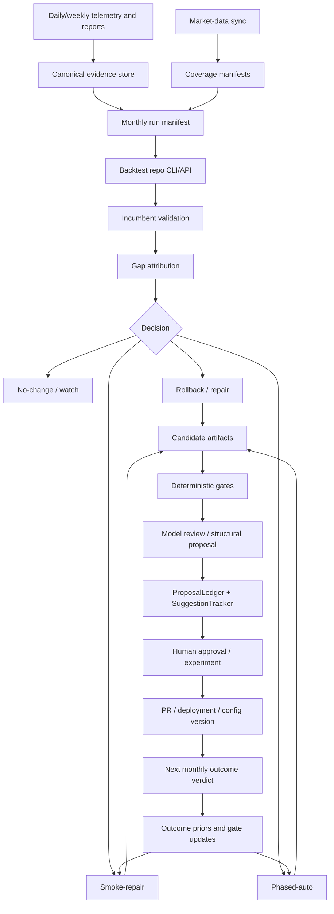

# Monthly Learning Loop Target State Implementation Plan

Date: 2026-05-11

Source report:
`docs/2026-05-11-workflow-learning-loop-target-state.md`

## 1. Goal

Implement the target state where `trading_assistant` becomes an
evidence-ranked strategy improvement orchestrator.

The system must be able to:

- collect bot telemetry, fills, configs, and deployment metadata;
- maintain canonical market-data coverage outside the code repos;
- freeze each completed month into a reproducible validation run;
- validate the current production config before optimizing anything;
- diagnose underperformance and route the strategy to no-change, watch, repair,
  rollback, smoke-repair, phased-auto, experiment, or manual review;
- call models only after deterministic evidence assembly;
- produce approval-ready proposals grounded in replay evidence;
- measure deployed changes through the next completed monthly validation window;
- feed measured outcomes back into future candidate generation, search
  allocation, gates, model prompts, and rollback priority.

The implementation must not make `trading_assistant` an autonomous trading
mutator. Trading behavior changes remain approval-gated.

## 2. Non-Negotiable Architecture Boundaries

| Area | Owner | Boundary |
|---|---|---|
| Orchestration | `trading_assistant` | Schedules runs, checks data coverage, builds manifests, invokes backtests, records ledgers, sends approval requests, and updates feedback priors. |
| Backtest execution | `trading_backtests` or equivalent shared backtest repo/package/host | Owns full-fidelity strategy engines, replay plugins, smoke-repair, phased-auto, and artifact generation. |
| Market data | Shared `trading_data` root | Stores canonical parquet, tick archives, feature caches, coverage manifests, and run artifacts outside git. |
| Live VPS bots | Bot repos/VPSes | Supply telemetry, production config identifiers, fills, and deployment metadata. They are not called for replay or optimization. |
| Model reasoning | Agent runtime through `trading_assistant` | Performs synthesis, candidate review, structural proposal generation, and explanation after deterministic evidence is available. |
| Approval | Human-in-the-loop flow | Required for material trading logic, parameter, sizing, routing, or risk behavior changes. |

Initial local layout:

```text
C:\Users\sehyu\Documents\Other\Projects\
  trading_assistant\
  trading_backtests\
  trading_data\
    market\
    runs\
```

Required environment/config entries:

| Name | Purpose |
|---|---|
| `BACKTEST_REPO_PATH` | Local path to the shared backtest repo or package root. |
| `MARKET_DATA_ROOT` | Canonical market-data root outside both code repos. |
| `BACKTEST_ARTIFACT_ROOT` | Root for monthly validation, smoke-repair, phased-auto, and replay parity artifacts. |
| `MONTHLY_VALIDATION_ENABLED` | Feature flag for shadow and production rollout. |
| `MONTHLY_VALIDATION_MODE` | `shadow`, `approval_gated`, or `disabled`. |
| `MONTHLY_VALIDATION_DAY` / `HOUR` / `MINUTE` | Schedule after data sync and monthly close. |
| `BACKTEST_COMMAND_TIMEOUT_SECONDS` | Hard timeout for backtest subprocess/API calls. |
| `BACKTEST_MAX_PARALLEL_STRATEGIES` | Prevents local machine overload. |
| `MARKET_DATA_REQUIRED_COVERAGE_RATIO` | Blocks authoritative verdicts when coverage is insufficient. |

## 3. Target Run Flow



Daily and weekly reports remain diagnostic sensors. The monthly loop becomes
the authoritative mechanism for material strategy learning.

## 4. Implementation Workstreams

| Workstream | Main output | Depends on |
|---|---|---|
| Architecture and config | ADR, env/config, run boundaries | None |
| Attribution contract | Required lineage in telemetry and ledgers | Architecture |
| Canonical market data | Parquet, coverage manifests, data-source registry | Architecture |
| Backtest execution boundary | Manifest-driven runner client and artifact contract | Architecture, data |
| Replay parity | Strategy plugin readiness and parity reports | Backtest boundary, data |
| Monthly validation | Incumbent validation, gap attribution, statuses | Attribution, data, parity |
| Smoke-repair | Targeted rollback, ablation, perturbation, repair | Monthly validation |
| Phased-auto | Mature greedy optimization with gates | Monthly validation, plugins |
| Model review | Structured model proposals and validation | Monthly validation, candidates |
| Ledgers and outcomes | StrategyChangeLedger, monthly verdicts, follow-ups | Monthly validation |
| Feedback controls | Outcome priors into search, gates, prompts, rollback | Outcomes |
| Approval and rollout | Approval packets, deployment lineage, rollback policy | Ledgers, model review |

### 4.1 Three-Phase Delivery Split

The detailed implementation sections below remain the source of truth. For
execution, group them into three delivery phases:

| Delivery phase | Existing sections included | Primary outcome |
|---|---|---|
| Phase 1: Evidence And Replay Foundation | Sections 5-11: contracts, architecture/config, attribution, market data, `StrategyChangeLedger`, backtest boundary, replay parity, monthly validation orchestrator | One strategy can complete a shadow monthly incumbent validation with coverage, replay parity, gap attribution, and a ledgered no-change/watch/repair status. |
| Phase 2: Candidate Generation And Approval-Ready Improvements | Sections 12-14 and relevant approval pieces from section 17: smoke-repair, phased-auto, deterministic gates, model review, structural proposals, approval packet evidence | A replay-ready strategy can turn monthly validation failures into evidence-backed approval-ready candidates without bypassing deterministic gates. |
| Phase 3: Learning Loop Closure And Rollout | Sections 15-18 plus 19-25: monthly outcome replacement, source-aware outcomes, follow-up verdicts, outcome priors, rollback policy, migration, tests, rollout | Deployed changes are measured by monthly validation and their outcomes alter future search, gates, priors, model context, and rollback priority. |

Phase 1 proves the system can measure reality. Phase 2 proves it can generate
defensible improvements. Phase 3 proves those improvements compound into a
closed learning loop.

### 4.2 Existing Components To Reuse

Do not rebuild existing primitives:

- `TradeEvent` and `MissedOpportunityEvent` already carry deployment,
  experiment, variant, parameter-set, strategy-version, config-version,
  signal-generation-version, and code-SHA lineage. Enforce, audit, and
  propagate these fields; do not add duplicate lineage fields to those payloads.
- `DeploymentRecord`, `ProposalLedger`, `SuggestionTracker`,
  `ApprovalTracker`, and `DeploymentMonitor` already cover much of the
  proposal/approval/deployment lifecycle. Extend their links into
  `StrategyChangeLedger` rather than replacing them.
- `objective_weights_v1` already exists in `schemas/objective_weights.py`.
  `ParameterSearcher._composite_score` is the reference implementation for
  composite candidate scoring.
- Current WFO utilities for fold generation, cost sensitivity, robustness, and
  leakage checks should be reused where appropriate. `BacktestSimulator`
  remains screening/legacy for monthly authority because it is not
  full-fidelity replay.
- `LearningCycle` and `LearningLedger` remain the weekly learning layer.
  Monthly validation runs downstream of them and supplies stronger outcome
  verdicts.
- `StructuralProposal` already exists in `schemas/agent_response.py`; extend it
  for monthly-loop fields rather than creating a parallel proposal type unless
  a separate transport schema is strictly required.
- `SchedulerConfig`, `build_scheduled_job_specs`, `ScheduledRunStore`,
  `RunIndex`, `EventStream`, and `SubagentManager` should be reused for monthly
  jobs, progress events, long-running runs, and run provenance.
- `ConfigRegistry` already loads bot YAML profiles, but config-version
  propagation must be added where missing.

## 5. Data And Artifact Contracts

### 5.1 Shared Data Root

Production data must not be committed to `trading_assistant` or
`trading_backtests`.

Recommended layout:

```text
trading_data/
  market/
    <source>/
      raw/
      bars_1m/
      bars_5m/
      bars_30m/
      daily/
      ticks/
      order_book/
      features/
      manifests/
  runs/
    monthly_validation/
      YYYY-MM/
        run_manifest.json
        coverage_manifest.json
        incumbent_validation.json
        gap_attribution.json
        mode_decision.json
        candidate_results.jsonl
        selected_candidates.json
        rejected_candidates.jsonl
        model_review.json
        monthly_report.md
```

### 5.2 Run Manifest

Create `schemas/monthly_run_manifest.py`.

Required fields:

- `run_id`;
- `run_month`;
- `created_at`;
- `mode`: `incumbent_validation`, `smoke_repair`, `phased_auto`,
  `structural_review`, or `outcome_measurement`;
- `bot_id`;
- `strategy_id`;
- `strategy_version`;
- `config_version`;
- `deployment_id`;
- `parameter_set_id`;
- `proposal_ids`;
- `suggestion_ids`;
- `objective_version`;
- `latest_month_start`;
- `latest_month_end`;
- `calibration_start`;
- `calibration_end`;
- `selection_oos_start`;
- `selection_oos_end`;
- `market_data_manifest_path`;
- `telemetry_manifest_path`;
- `backtest_repo_path`;
- `backtest_repo_commit_sha`;
- `backtest_command`;
- `artifact_root`;
- `approval_mode`: `none`, `experiment`, `manual_required`;
- `expected_outputs`.

### 5.3 Coverage Manifest

Create `schemas/market_data_manifest.py`.

Required fields:

- `manifest_id`;
- `source`;
- `market`;
- `symbol`;
- `timeframe`;
- `start_ts`;
- `end_ts`;
- `expected_bars`;
- `actual_bars`;
- `coverage_ratio`;
- `missing_ranges`;
- `session_calendar`;
- `timezone`;
- `checksum`;
- `schema_version`;
- `source_version`;
- `adjustment_policy`;
- `fee_model_version`;
- `slippage_model_version`;
- `usable_for_authoritative_validation`;
- `blocking_reasons`.

### 5.4 Backtest Artifact Contract

Create `schemas/backtest_artifacts.py`.

The backtest repo must return a machine-readable artifact index containing:

- `coverage_manifest.json`;
- `incumbent_validation.json`;
- `gap_attribution.json`;
- `mode_decision.json`;
- `candidate_results.jsonl`;
- `selected_candidates.json`;
- `rejected_candidates.jsonl`;
- `replay_parity_report.json`;
- `objective_breakdown.json`;
- `monthly_report.md`;
- `stderr.log`;
- `stdout.log`;
- `exit_status.json`.

`trading_assistant` must reject authoritative verdicts when required artifacts
are missing, malformed, stale, or not linked to the run manifest.

### 5.5 Objective And Gate Contract

All selection and outcome measurement must use the existing objective from
`memory/policies/v1/soul.md` and `schemas/objective_weights.py`.

Canonical weights:

- net profit / expected return: 30%;
- Calmar: 20%;
- profit factor: 15%;
- expectancy: 15%;
- max drawdown: 10%;
- process quality: 10%.

When process quality cannot be replayed, use the renormalized no-process
weights from `schemas/objective_weights.py`. Trade frequency is a viability and
under-trading gate, not a standalone objective that can override expectancy,
Calmar, drawdown, or expected return.

Hard gates:

- sufficient market-data coverage;
- sufficient telemetry lineage;
- acceptable replay parity;
- no leakage across calibration and validation windows;
- no material in-sample deterioration;
- latest-month OOS improvement for selected repair candidates;
- positive support across purged folds where phased-auto is used;
- sufficient trade count or explicit sparse-sample classification;
- realistic fees, slippage, spread, and funding;
- no material increase in max drawdown;
- no concentration in one or two outlier wins;
- no breakage of portfolio, leverage, symbol, heat-cap, or risk constraints;
- no approval-ready proposal from unsupported or diagnostics-only strategies.

## 6. Phase 0: Architecture Decisions And Feature Flags

### Purpose

Make the boundaries explicit before building code. This prevents the system
from quietly embedding backtest engines into `trading_assistant`, committing
market data into code repos, or treating legacy WFO as authoritative.

### Implementation

Add an ADR under `docs/adr/` covering:

- current WFO is screening/legacy unless upgraded to full-fidelity replay;
- `AutoOutcomeMeasurer` is early warning/context only for material strategy
  changes;
- `trading_assistant` is the orchestrator and evidence ledger;
- `trading_backtests` or a shared host owns replay engines;
- market data lives under `MARKET_DATA_ROOT`;
- monthly validation is the authoritative learning loop;
- model outputs cannot bypass deterministic gates;
- manual approval is required for material trading behavior changes.

Update `orchestrator/config.py` with:

- `backtest_repo_path`;
- `market_data_root`;
- `backtest_artifact_root`;
- `monthly_validation_enabled`;
- `monthly_validation_mode`;
- monthly schedule settings;
- backtest timeout and concurrency settings;
- coverage thresholds.

Update docs and `.env.example` with the new variables.

### Tests

- config defaults load without breaking existing tests;
- invalid `BACKTEST_REPO_PATH` disables monthly validation with a clear warning;
- invalid `MARKET_DATA_ROOT` blocks authoritative runs;
- `MONTHLY_VALIDATION_MODE=shadow` never creates approval-ready actions.

### Exit Criteria

- one documented source of truth exists for ownership boundaries;
- feature flags allow safe shadow-mode rollout;
- existing daily, weekly, WFO, and outcome jobs still run unchanged.

## 7. Phase 1: Attribution And Telemetry Contract

### Purpose

Monthly validation is only useful if every live trade, missed opportunity,
config change, and deployment can be linked to the strategy and config that
produced it.

### Implementation

First audit existing schemas before adding fields. `TradeEvent` and
`MissedOpportunityEvent` already contain the core lineage fields. The work is
to enforce coverage, propagate lineage into aggregates, and block monthly
authority when lineage is incomplete.

Required fields where relevant:

- `bot_id`;
- `strategy_id`;
- `strategy_version`;
- `config_version`;
- `deployment_id`;
- `parameter_set_id`;
- `experiment_id`;
- `variant_id`;
- `code_sha`;
- `signal_id`;
- `bar_id`;
- `data_source_id`;
- `exchange_timestamp`;
- `local_timestamp`;
- `clock_skew_ms`.

Schema and propagation changes:

- add `lineage_summary` to `schemas/events.py::DailySnapshot`, populated during
  curation from trade and missed-opportunity events;
- add strategy/config/code version fields to bot config profiles where missing;
- add `experiment_id` and `code_sha` to deployment records where missing;
- ensure daily metrics emit `lineage_gap` warnings when material lineage fields
  are absent.

Relevant files:

- `schemas/events.py`;
- `schemas/enriched_events.py`;
- `schemas/bot_config.py`;
- `schemas/deployment_monitoring.py`;
- `orchestrator/orchestrator_brain.py`;
- `orchestrator/worker.py`;
- `skills/build_daily_metrics.py`;
- bot instrumentation under `_references/*/instrumentation` where applicable.

Add telemetry compatibility checks per bot:

- event producer emits required lineage;
- event IDs remain deterministic;
- missing lineage produces a warning in daily reports;
- missing lineage blocks monthly authoritative verdicts.

### Output

Create `schemas/telemetry_manifest.py` and a generated
`telemetry_manifest.json` per bot/strategy/month with:

- event counts by type;
- lineage coverage ratio;
- missing-field counts;
- time coverage;
- duplicate count;
- known gaps;
- authoritative eligibility.

Create `orchestrator/lineage_audit.py` and `schemas/lineage_audit.py` if daily
lineage checks need a standalone job. The audit should write
`memory/findings/lineage_gaps.jsonl` and can emit instrumentation requests when
fields are persistently missing.

### Tests

- schema validation rejects missing required fields for monthly-critical event
  types;
- legacy events remain ingestible but are marked non-authoritative;
- `DailySnapshot.lineage_summary` is populated from mixed-lineage events;
- monthly validation refuses to run for a strategy whose lineage coverage is
  below threshold.

### Exit Criteria

- every strategy can be classified as authoritative-ready,
  diagnostics-only, or insufficient-lineage;
- live-vs-replay comparisons can map observed trades to strategy/config
  versions.

## 8. Phase 2: Canonical Market-Data Sync

### Purpose

Bot event data is not enough to test alternate parameters. The system needs
canonical market data that can replay alternate entries, exits, filters, and
missed opportunities.

### Implementation

Create:

- `schemas/market_data_manifest.py`;
- `skills/market_data_sync.py`;
- `skills/market_data_catalog.py`;
- `skills/coverage_manifest_writer.py`;
- `orchestrator/market_data_jobs.py` or a handler in `orchestrator/handlers.py`.

Add a data-source adapter interface:

```python
class MarketDataAdapter(Protocol):
    source_id: str
    def sync(self, request: MarketDataSyncRequest) -> MarketDataSyncResult: ...
    def validate_coverage(self, request: CoverageRequest) -> CoverageManifest: ...
```

Initial adapters:

- `KisMarketDataAdapter` for Korean equities where credentials and endpoints
  support historical minute bars;
- `BotUploadedParquetAdapter` for markets where bots are the only reliable
  source;
- `FileSystemParquetAdapter` for already downloaded vendor/exchange data.

KIS-specific requirement:

- verify endpoint capability per account/environment;
- use historical minute endpoints when available;
- archive live WebSocket tick/order-book data going forward when OHLCV is not
  enough for a strategy;
- mark a KIS strategy diagnostics-only if required intraday or microstructure
  data is unavailable.

The sync job should:

1. Resolve required symbols/timeframes per strategy.
2. Download or ingest data into `MARKET_DATA_ROOT`.
3. Normalize timestamps and sessions.
4. Apply adjustment policy.
5. Write parquet partitions.
6. Write `coverage_manifest.json`.
7. Block monthly validation if coverage is insufficient.

### Output

Market data root contains:

- immutable parquet partitions;
- checksums;
- source metadata;
- session calendar metadata;
- fee/slippage model references;
- coverage manifests.

### Tests

- manifest generation with full coverage;
- manifest generation with missing bars;
- KIS adapter handles pagination/rate limits;
- bot-upload fallback is marked lower confidence;
- incomplete data blocks authoritative monthly verdicts.

### Exit Criteria

- monthly run manifests can point to a valid coverage manifest;
- each replay job can prove exactly which data version it used;
- no production market data is committed to either code repo.

## 9. Phase 3: StrategyChangeLedger

### Purpose

The system needs one strategy-level record answering what changed, why, when,
under which evidence, and whether it worked.

### Implementation

Create:

- `schemas/strategy_change_ledger.py`;
- `skills/strategy_change_ledger.py`.

Storage:

- JSONL under `memory/findings/strategy_change_ledger.jsonl` initially;
- optional SQLite table later if query volume requires it.

Record types:

- `monthly_review`;
- `proposed_change`;
- `accepted_change`;
- `implemented_change`;
- `deployed_change`;
- `rollback`;
- `quarantine`;
- `repair`;
- `watch`;
- `no_change`;
- `one_month_verdict`;
- `follow_up_verdict`.

Required fields:

- bot and strategy identifiers;
- prior and new config versions;
- mutation diff;
- proposal IDs and suggestion IDs;
- approval request ID;
- PR URL and commit SHA;
- deployment ID and deployed timestamp;
- evidence artifact paths;
- objective deltas;
- decision reason;
- monthly verdict;
- follow-up verdict;
- rollback/quarantine status.

Integration points:

- `skills/proposal_ledger.py`;
- `skills/suggestion_tracker.py`;
- `skills/approval_tracker.py`;
- `skills/deployment_monitor.py`;
- `analysis/context_builder.py`.

### Tests

- append-only writes are atomic;
- duplicate change IDs are rejected;
- ledger joins to proposal and suggestion IDs;
- monthly no-change decisions are recorded;
- context builder can load recent strategy changes.

### Exit Criteria

- a reviewer can reconstruct the lifecycle of any material strategy change from
  one ledger;
- broad candidate noise remains in `ProposalLedger`;
- selected/deployed/rolled-back/no-change strategy decisions enter
  `StrategyChangeLedger`.

## 10. Phase 4: Backtest Execution Boundary And Replay Parity

### Purpose

`trading_assistant` must invoke full-fidelity replay without owning strategy
engines. The first strategy family must prove replay parity before optimization
is trusted.

### Implementation In `trading_assistant`

Create:

- `schemas/backtest_artifacts.py`;
- `schemas/replay_parity.py`;
- `skills/backtest_runner_client.py`;
- `skills/replay_parity_checker.py`;
- `orchestrator/backtest_invocation.py`.

`BacktestRunnerClient` responsibilities:

- validate `BACKTEST_REPO_PATH`;
- read the backtest repo commit SHA;
- build the command from `run_manifest.json`;
- execute subprocess/API call with timeout;
- capture stdout/stderr;
- locate artifact index;
- validate artifacts against schemas;
- return a typed result to the monthly orchestrator.

Do not import strategy engines directly into `trading_assistant`.

### Implementation In `trading_backtests`

Create or standardize:

- shared `StrategyPlugin` protocol;
- manifest-driven CLI:
  `python -m backtests.shared.monthly_repair --manifest <run_manifest.json>`;
- incumbent validation runner;
- replay parity runner;
- smoke-repair runner;
- phased-auto runner;
- artifact writer.

Strategy plugins own:

- data loading from manifest-backed parquet;
- production config loading;
- replay implementation;
- mutation semantics;
- candidate generation;
- diagnostics;
- metric extraction;
- strategy-specific gates.

Reference implementation should use the `_references/trading/` patterns:

- `backtests/shared/auto/plugin.py`;
- `backtests/shared/auto/phase_runner.py`;
- `backtests/shared/smoke/latest_oos_smoke.py`;
- `backtests/shared/validation/oos_validation.py`;
- `backtests/swing/auto/oos_repair_diagnostics.py`;
- `backtests/swing/auto/incumbent_repair.py`.

### Replay Parity

For each target strategy, compare replayed incumbent behavior to observed live
behavior:

- trade count;
- entry timestamp match;
- exit timestamp match;
- side/quantity match;
- fill price delta;
- PnL delta;
- fee/slippage delta;
- drawdown delta;
- missing trade explanations;
- extra simulated trade explanations.

Classify parity:

- `pass`: eligible for monthly validation and candidate generation;
- `pass_with_known_gaps`: eligible for limited use with explicit caveats;
- `fail`: diagnostics-only;
- `insufficient_data`: diagnostics-only.

### Tests

- runner rejects missing backtest repo;
- runner records commit SHA;
- malformed artifact index fails closed;
- parity report blocks optimization when below threshold;
- unsupported strategy remains diagnostics-only.

### Exit Criteria

- at least one strategy family can run incumbent replay from a manifest;
- artifact validation is deterministic;
- no live VPS is called for replay or optimization.

## 11. Phase 5: Monthly Validation Orchestrator

### Purpose

Build the monthly workflow that freezes evidence, validates the incumbent,
diagnoses gaps, chooses a mode, writes ledgers, and optionally produces
candidate requests.

### Implementation

Create:

- `schemas/monthly_validation.py`;
- `skills/monthly_validation_orchestrator.py`;
- `skills/monthly_gap_attribution.py`;
- `analysis/monthly_validation_report_builder.py`;
- `orchestrator/monthly_validation_handler.py` or handler functions in
  `orchestrator/handlers.py`.

Update:

- `orchestrator/scheduler.py`;
- `orchestrator/catchup.py`;
- `orchestrator/app.py`;
- `orchestrator/config.py`;
- `orchestrator/event_stream.py`;
- `orchestrator/run_index.py`;
- `orchestrator/scheduled_runs.py`;
- `orchestrator/subagent.py`;
- `schemas/tasks.py`.

Execution notes:

- run as a tracked scheduled job so catch-up and status are visible;
- use `SubagentManager` or equivalent long-running task isolation for heavy
  monthly runs;
- emit progress events such as `market_data_sync_done`,
  `monthly_validation_progress`, `parity_audit_result`, and
  `rollback_recommendation`;
- index run artifacts through existing run-history conventions.

Workflow:

1. Resolve latest completed month per bot/market timezone.
2. Confirm telemetry and data manifests.
3. Freeze run metadata.
4. Validate incumbent production config.
5. Compare expected backtest profile to observed live profile.
6. Attribute gaps.
7. Classify status.
8. Decide whether repair is needed.
9. Write `StrategyChangeLedger` monthly review.
10. Trigger smoke-repair, phased-auto, model review, or no-change flow.

Monthly statuses:

- `keep`;
- `watch`;
- `repair`;
- `rollback`;
- `quarantine`;
- `experiment`;
- `insufficient_data`;
- `insufficient_lineage`;
- `unsupported_no_replay_plugin`;
- `no_change`.

Gap attribution categories:

- under-trading;
- outlier loss;
- broad degradation;
- execution drift;
- slippage/cost drift;
- data gap;
- regime mismatch;
- harmful accepted mutation;
- filter overreach;
- entry signal decay;
- exit mismatch;
- portfolio/correlation crowding;
- opportunity scarcity.

### Tests

- latest month is frozen correctly;
- sparse month uses trailing context but remains marked sparse;
- incumbent validation always runs before candidate generation;
- latest month is marked as validation first and selection-OOS second;
- insufficient data produces no approval-ready proposal;
- monthly review records no-change decisions.

### Exit Criteria

- one full shadow monthly validation can run for one strategy;
- every strategy receives a status;
- monthly report and machine-readable result are written.

## 12. Phase 6: Smoke-Repair Mode

### Purpose

Provide targeted repair when the latest month identifies a specific failure
mode or a recent accepted mutation may have caused degradation.

### Implementation

In `trading_backtests`, implement or port a shared smoke-repair runner using:

- `backtests/shared/smoke/latest_oos_smoke.py`;
- `backtests/shared/validation/oos_validation.py`;
- `backtests/swing/auto/oos_repair_diagnostics.py`;
- `backtests/swing/auto/incumbent_repair.py`.

Candidate families:

- accepted-prefix rollback;
- one-at-a-time mutation removal;
- cluster rollback;
- local numeric perturbation;
- boolean toggles;
- targeted candidates from gap attribution;
- cost/slippage robustness variants;
- filter threshold relax/tighten variants;
- exit rule variants where failure is exit-specific.

Ranking:

- compare against frozen incumbent;
- require latest-month selection-OOS improvement;
- require calibration support;
- require cost and drawdown gates;
- record rejected candidates and reasons;
- never select candidates that only improve through unrealistic trade count or
  one outlier win.

### `trading_assistant` Integration

The monthly orchestrator should call smoke-repair when:

- latest month materially underperformed;
- accepted mutations are suspect;
- under-trading, outlier losses, execution drift, or filter overreach is
  diagnosed;
- strategy plugin maturity is not enough for broad phased-auto;
- a rollback or narrow repair decision is more valuable than broad search.

### Tests

- known harmful mutation is found by ablation;
- rollback candidates are evaluated before broad optimization;
- accepted-prefix logic preserves lineage;
- each candidate receives keep/reject/repair/experiment status;
- selected smoke candidate writes proposal and evidence artifacts.

### Exit Criteria

- smoke-repair can explain whether recent mutations likely caused degradation;
- repair output is suitable for deterministic gates and model review.

## 13. Phase 7: Phased-Auto Mode

### Purpose

Provide mature broad optimization when a strategy has sufficient data, a stable
plugin, known candidate phases, and adequate sample size.

### Implementation

In `trading_backtests`, port or implement a shared phased-auto runner inspired
by `_references/trading/backtests/shared/auto`.

Core components:

- `StrategyPlugin`;
- phase specs;
- phase state;
- candidate families;
- greedy optimizer;
- objective scorer;
- phase gates;
- progress monitor;
- artifact writer;
- replay bundle cache.

Candidate phases should be strategy-specific but follow a shared contract:

- baseline incumbent;
- safe ablation;
- local perturbation;
- targeted repair;
- structural parameter families;
- interaction checks;
- cost sensitivity;
- portfolio/synergy checks;
- final shortlist.

Validation:

- anchored calibration window before the latest month;
- purged monthly or quarterly folds inside calibration;
- embargo around fold boundaries;
- latest month used as selection-OOS after incumbent validation;
- optional trailing 3-6 month context for sparse strategies;
- later month reserved for deployed outcome verdict.

Selection objective:

- use `objective_weights_v1`;
- renormalize if process quality cannot be replayed;
- use trade frequency as a viability gate, not as the dominant objective.

### `trading_assistant` Integration

Run phased-auto when:

- replay parity passes;
- data coverage passes;
- strategy plugin maturity is high;
- broad search is justified;
- prior outcomes identify productive mutation families;
- smoke-repair is insufficient or points to a larger search space.

### Tests

- selected candidates improve canonical objective;
- candidate ranking is stable on golden fixtures;
- weak phase families can be skipped by negative priors;
- all rejected candidates have rejection reasons;
- fold leakage checks fail closed.

### Exit Criteria

- at least one strategy can run phased-auto in shadow mode;
- selected candidates include full objective breakdown and risk gates;
- the runner records enough evidence for model review and approval.

## 14. Phase 8: Hybrid Model Review And Structural Proposals

### Purpose

Use LLM reasoning where it adds value: synthesis, explanation, candidate
review, and structural proposal generation after deterministic evidence exists.

### Implementation

Create:

- `schemas/monthly_model_review.py`;
- `analysis/monthly_repair_prompt_assembler.py`;
- `analysis/monthly_model_response_parser.py`;
- `analysis/monthly_model_response_validator.py`.

Extend `schemas/agent_response.py::StructuralProposal` rather than replacing
it. Add monthly-loop fields only where needed:

- `evidence_paths`;
- `risk_classification`;
- `objective_impact`;
- `affected_strategy_id`;
- `affected_config_version`;
- `replay_or_experiment_plan`;
- `rollback_plan`;
- `routing`.

Prompt package must include:

- run manifest;
- incumbent validation result;
- gap attribution;
- smoke-repair results;
- phased-auto results;
- rejected candidates;
- objective deltas;
- data-quality status;
- replay parity status;
- prior monthly outcomes;
- accepted mutation history;
- risk flags;
- approval policy.

Model output schema must require:

- proposal type;
- strategy/config scope;
- evidence paths;
- hypothesized mechanism;
- expected objective impact;
- risk class;
- replay or experiment plan;
- acceptance criteria;
- rollback plan;
- routing decision: smoke-repair, phased-auto, experiment, or manual design
  review.

Models may propose:

- split by regime, session, setup grade, or engine family;
- redesign an exit rule;
- revise filter ordering;
- separate entry quality from execution bottlenecks;
- change coordination or cooldown logic;
- quarantine interacting mutations;
- request additional deterministic tests.

Models may not:

- approve changes;
- bypass gates;
- create actionable changes without evidence paths;
- write production configs;
- invent unsupported backtest results.

### Tests

- model output without evidence paths is rejected;
- unsupported structural proposal remains hypothesis-only;
- validator routes risk classes to correct approval gates;
- parser handles malformed markdown/JSON safely;
- prompt assembly stays within configured context budgets.

### Exit Criteria

- shortlisted candidates and structural proposals can be reviewed by a model
  without losing deterministic provenance;
- every model-derived actionable proposal is machine-readable and
  approval-gated.

## 15. Phase 9: Outcome Measurement Replacement

### Purpose

Replace lightweight weekly/daily-summary outcome closure with the monthly
validation loop for material strategy/config changes.

### Implementation

Create:

- `skills/monthly_outcome_measurer.py`;
- `schemas/monthly_outcome.py`;
- follow-up scheduler records for three-month or minimum-trade-count
  confirmation.

Update:

- `skills/auto_outcome_measurer.py`;
- `orchestrator/app.py::_measure_outcomes`;
- `orchestrator/scheduler.py`;
- `skills/suggestion_tracker.py`;
- `skills/proposal_ledger.py`;
- `skills/suggestion_scorer.py`;
- `skills/forecast_tracker.py`;
- `skills/prediction_tracker.py`;
- `analysis/context_builder.py`.

Lifecycle change:

- `AutoOutcomeMeasurer` remains early warning/context only;
- material deployed changes are not marked finally measured by 7/14/30-day
  daily-summary windows;
- the first completed month after deployment becomes the primary verdict;
- three-month or minimum-trade-count follow-up can confirm, downgrade, or
  overturn the primary verdict.

Source-aware measurement:

- change `SuggestionTracker.mark_measured` to accept
  `source="early_warning" | "monthly" | "follow_up"`;
- add `outcome_source` and `outcome_source_history` to suggestion records;
- `AutoOutcomeMeasurer` should tag records as `early_warning` and should not
  finalize medium+ risk material strategy changes;
- monthly outcome measurement should mark material changes as measured with
  `source="monthly"`;
- follow-up measurement should write `source="follow_up"` and may confirm,
  downgrade, or overturn the one-month verdict;
- existing outcome records without a source should be read as `early_warning`;
- scoring, forecast, prediction, and context consumers should distinguish
  early-warning records from authoritative monthly/follow-up outcomes.

Monthly verdict fields:

- `verdict`: keep, watch, repair, rollback, quarantine, inconclusive;
- live-vs-expected objective delta;
- trade frequency delta;
- drawdown delta;
- execution/slippage delta;
- gap attribution;
- confidence;
- data sufficiency;
- recommended next action.

### Tests

- deployed suggestion is not prematurely marked measured by weekly check;
- monthly verdict writes to all three ledgers;
- `mark_measured(..., source="monthly")` records the outcome source;
- existing source-less outcomes remain readable as early warnings;
- follow-up record is scheduled;
- inconclusive verdict does not become positive prior;
- rollback verdict creates a clear next action.

### Exit Criteria

- monthly validation is the primary outcome mechanism;
- legacy weekly outcome measurement cannot close material changes too early.

## 16. Phase 10: Operational Feedback Controls

### Purpose

Make outcomes change future behavior, not only future prompt context.

### Implementation

Create:

- `schemas/outcome_priors.py`;
- `skills/outcome_prior_store.py`;
- `skills/search_allocation_policy.py`;
- `skills/monthly_outcome_scorer.py`.

Update:

- `skills/suggestion_scorer.py`;
- `analysis/context_builder.py`;
- `analysis/response_validator.py`;
- monthly validation orchestrator;
- smoke-repair and phased-auto manifest inputs.

Feedback should affect:

- candidate generation;
- phase ordering;
- search budget allocation;
- smoke-test order;
- acceptance gates;
- negative priors for failed mutation families;
- rollback and quarantine priority;
- model prompt context;
- structural proposal confidence.

Positive prior rules:

- strengthen only after one-month positive plus persistence confirmation, or
  after high-confidence minimum-trade evidence;
- increase search allocation toward the specific mutation family and strategy
  context;
- never loosen hard safety gates.

Negative prior rules:

- apply immediately after one-month negative if attribution is strong;
- require stronger evidence for repeated failed categories;
- prioritize rollback or quarantine when drawdown/execution degradation is
  severe;
- reduce model confidence in similar structural proposals.

### Tests

- failed mutation family is deprioritized in next smoke-repair;
- successful family receives bounded increased allocation;
- priors do not override hard gates;
- context builder includes authoritative monthly outcomes separately from
  lightweight outcomes;
- repeated negative categories require stricter validation.

### Exit Criteria

- monthly outcomes change the next run's candidate space and gate behavior;
- prompt context and deterministic search use the same outcome-prior source.

## 17. Phase 11: Approval, Deployment, And Rollback Integration

### Purpose

Ensure every material change has evidence, lineage, approval, deployment
metadata, and rollback policy.

### Implementation

Update:

- `skills/approval_handler.py`;
- `skills/approval_tracker.py`;
- `orchestrator/permission_gates.py`;
- `skills/github_pr.py`;
- `skills/deployment_monitor.py`;
- `schemas/autonomous_pipeline.py::ApprovalRequest`;
- `comms` renderers for approval packets;
- `schemas/permissions.py`;
- `schemas/strategy_suggestions.py`.

Approval packet must include:

- strategy and config scope;
- reason for change;
- incumbent validation summary;
- smoke/phased-auto evidence;
- objective deltas;
- latest-month behavior;
- calibration support;
- data coverage status;
- replay parity status;
- risk classification;
- rollback plan;
- artifact paths;
- model review if used;
- human-readable summary and machine-readable payload.

Deployment writeback must include:

- PR URL;
- commit SHA;
- strategy version;
- config version;
- deployment ID;
- deployed timestamp;
- linked proposal IDs;
- linked suggestion IDs;
- linked strategy change ID.

Rollback policy:

- emergency rollback recommendation for severe drawdown or execution drift;
- quarantine for interacting or poorly attributed mutations;
- watch when evidence is weak but concerning;
- repair when a targeted fix has evidence;
- keep only when monthly validation supports the change.

Create:

- `schemas/rollback_thresholds.py`;
- `memory/policies/v1/rollback_thresholds.yaml`;
- `skills/rollback_advisor.py`.

Rollback thresholds should be versioned policy, not prompt-only judgment. The
advisor can emit rollback recommendations from monthly verdicts or severe
early-warning anomalies, but rollback actions remain human-approved.

### Tests

- approval request fails if evidence paths are missing;
- material trading behavior change requires manual approval;
- deployment writeback updates `StrategyChangeLedger`;
- rollback recommendation is auditable;
- rollback advisor creates an approval-gated recommendation when thresholds are
  breached;
- approval packet renders across Telegram/Discord/email without losing the
  machine-readable payload.

### Exit Criteria

- no material strategy/config change can be approved or deployed without
  evidence and lineage;
- rollback and quarantine decisions are tracked with the same rigor as
  approvals.

## 18. Phase 12: Tests, Shadow Runs, And Migration

### Purpose

Prove the new loop end to end before it influences approval routing.

### Test Layers

Unit tests:

- new schemas;
- config loading;
- run manifest generation;
- coverage manifest validation;
- objective scoring;
- ledger writes;
- outcome-prior updates;
- model output parsing and validation.

Integration tests:

- monthly run manifest -> backtest client -> artifact ingestion;
- incumbent validation -> gap attribution -> mode decision;
- smoke-repair artifact -> ProposalLedger -> model review;
- phased-auto artifact -> deterministic gates -> approval packet;
- deployment writeback -> monthly outcome verdict -> priors.

Fixture tests:

- known harmful mutation for smoke-repair;
- known candidate ranking for phased-auto;
- incomplete market data;
- failed replay parity;
- sparse latest month;
- malformed model output;
- missing lineage.

Shadow-mode tests:

- run monthly validation without approval routing;
- compare reports to current weekly/WFO outputs;
- verify no production configs are changed;
- manually inspect artifact paths and ledger records.

Migration:

- label current WFO as screening/legacy;
- keep current WFO available until monthly validation is stable;
- change `AutoOutcomeMeasurer` semantics before monthly verdicts become
  authoritative;
- add compatibility readers for existing `suggestions.jsonl`,
  `proposal_ledger.jsonl`, and `outcomes.jsonl`;
- document diagnostics-only status for strategies without replay plugins;
- add migration docs for WFO-to-monthly, outcome-measurer-to-monthly, and
  structural-proposal extension.

### Exit Criteria

- one strategy family completes a full shadow monthly cycle;
- artifacts are reproducible from manifest, data checksum, config version, and
  code SHA;
- failures block authoritative verdicts rather than producing false confidence;
- approval-gated rollout can start strategy by strategy.

## 19. Strategy Rollout Plan

### 19.1 First Strategy Family

Choose the first strategy family by:

- available full-fidelity engine;
- reliable market data;
- clean production config lineage;
- sufficient trade count;
- manageable strategy complexity;
- clear acceptance criteria.

Recommended first pass:

- use an existing `_references/trading/` strategy with mature backtest
  patterns, such as the NQDTC-style path referenced by
  `backtests/swing/auto/oos_repair_diagnostics.py`;
- avoid starting with a strategy whose replay depends on unavailable
  tick/order-book data.

### 19.2 Expansion Criteria

A new strategy becomes eligible when:

- telemetry lineage passes;
- market-data coverage passes;
- replay plugin exists;
- incumbent parity passes;
- smoke-repair or phased-auto fixtures exist;
- monthly validation can produce a no-change/watch/repair decision in shadow
  mode.

### 19.3 Diagnostics-Only Strategies

Strategies remain diagnostics-only when:

- market data is unavailable;
- replay plugin is missing;
- replay parity fails;
- lineage is insufficient;
- latest month is too sparse and no trailing context can support a verdict.

Diagnostics-only still provides value through:

- daily/weekly anomaly detection;
- telemetry gap detection;
- process-quality monitoring;
- under-trading and execution drift hypotheses;
- data-collection recommendations;
- model-reviewed structural hypotheses that must remain non-actionable until
  replay support exists.

## 20. Operational Cadence

Daily:

- ingest telemetry;
- build daily metrics;
- detect process failures, drawdown, data gaps, execution anomalies, and health
  issues;
- record lightweight hypotheses;
- do not approve material strategy changes.

Weekly:

- synthesize daily evidence;
- update scorecards;
- run deterministic detectors;
- call models for cross-evidence synthesis when useful;
- triage strategies for monthly validation;
- keep `AutoOutcomeMeasurer` as early warning/context only.

Monthly:

- sync market data;
- freeze latest completed month;
- run coverage and telemetry manifests;
- validate incumbents;
- perform gap attribution;
- choose smoke-repair or phased-auto where justified;
- run model review for shortlisted candidates or structural proposals;
- route approval-ready proposals;
- record outcomes and feedback priors.

Quarterly or minimum-trade-count follow-up:

- confirm persistence;
- downgrade one-month false positives;
- update priors and rollback/quarantine status;
- review portfolio-level interactions.

## 21. Definition Of Done

The target state is achieved when:

- `trading_assistant` can run monthly validation in shadow and approval-gated
  modes;
- every authoritative run has a run manifest, data manifest, telemetry
  manifest, backtest repo commit SHA, config version, objective version, and
  artifact index;
- incumbent validation always precedes optimization;
- mode selection between no-change, watch, rollback, smoke-repair, and
  phased-auto is deterministic and auditable;
- models are called only after deterministic evidence exists;
- model outputs are structured and validated;
- approval packets include replay evidence, objective deltas, lineage, risk,
  and rollback plans;
- deployed changes are measured by the next completed monthly validation
  window;
- three-month or minimum-trade follow-up can confirm or overturn initial
  verdicts;
- outcomes directly alter future candidate generation, search allocation,
  smoke-test focus, acceptance gates, rollback priority, and model context;
- strategies without sufficient data or replay parity are clearly marked
  diagnostics-only.

## 22. Main Risks And Controls

| Risk | Control |
|---|---|
| Overfitting the latest month | Use latest month first as incumbent validation, require calibration support, purged folds, cost sensitivity, and follow-up verdicts. |
| Bad data produces false confidence | Coverage manifests, checksums, session metadata, missing-bar checks, and fail-closed verdicts. |
| Replay diverges from live behavior | Replay parity audit before optimization; known mismatches must be quantified. |
| Model invents plausible but unsupported changes | Structured evidence packages, schema validation, evidence paths, deterministic gates, and manual approval. |
| Data/code coupling becomes unmanageable | Keep production market data outside code repos; use manifests and commit SHAs. |
| Legacy WFO conflicts with monthly loop | Label current WFO screening/legacy and route authoritative decisions through monthly validation only. |
| Outcome measurement remains too noisy | Use next completed month as primary verdict; keep weekly checks as early warning only. |
| Feedback only changes prompts | Implement outcome priors that directly influence candidate generation, phase ordering, gates, and rollback priority. |
| Unsupported strategies are optimized anyway | Require replay plugin, data coverage, lineage, and parity before candidate generation. |

## 23. Suggested Build Order

### Phase 1: Evidence And Replay Foundation

1. Add ADR, config fields, env docs, and feature flags.
2. Add run manifest, coverage manifest, backtest artifact, objective/gate, and
   telemetry manifest schemas.
3. Add `StrategyChangeLedger`.
4. Build market-data catalog and coverage manifest writer.
5. Build backtest runner client and artifact validator.
6. Implement replay parity for one strategy family.
7. Build monthly validation orchestrator in shadow mode.

Phase 1 exit gate: one strategy completes a shadow monthly incumbent validation
with valid data coverage, telemetry coverage, replay parity, gap attribution,
monthly report, and `StrategyChangeLedger` monthly-review record.

### Phase 2: Candidate Generation And Approval-Ready Improvements

8. Integrate smoke-repair artifacts.
9. Integrate phased-auto artifacts.
10. Add model review and structural proposal extensions.
11. Enrich approval packets with replay evidence, objective deltas, risk class,
    and rollback plan.

Phase 2 exit gate: one replay-ready strategy can produce an approval-ready
candidate from a monthly failure mode, with deterministic gates passed, model
review where useful, rejected candidates recorded, and no production change
made without human approval.

### Phase 3: Learning Loop Closure And Rollout

12. Replace authoritative outcome measurement with monthly verdicts.
13. Add source-aware outcomes and follow-up verdicts.
14. Add outcome-prior feedback controls.
15. Integrate deployment writeback, rollback thresholds, and rollback advisor.
16. Run shadow monthly cycles until artifact and decision quality is stable.
17. Enable approval-gated mode strategy by strategy.

Phase 3 exit gate: deployed changes receive monthly and follow-up verdicts,
verdicts update ledgers and outcome priors, and future smoke-repair,
phased-auto, model context, acceptance gates, and rollback priority change
based on measured outcomes.

## 24. End-To-End Verification Checklist

1. Run the full test suite plus new monthly-loop tests.
2. Trigger a shadow monthly run for one bot/strategy.
3. Confirm `BACKTEST_ARTIFACT_ROOT/<bot>/<YYYY-MM>/` contains run, coverage,
   telemetry, incumbent validation, replay parity, gap attribution, and report
   artifacts.
4. Confirm `StrategyChangeLedger` has a `monthly_review` record with linked
   evidence paths.
5. Confirm the next context package includes strategy-change history and
   outcome priors where relevant.
6. Run a harmful-mutation fixture and confirm smoke-repair selects rollback or
   targeted repair before broad optimization.
7. Confirm approval requests for medium+ risk changes require evidence paths,
   objective deltas, and rollback plans.
8. Confirm `AutoOutcomeMeasurer` writes early-warning outcomes without
   finalizing medium+ risk material changes.
9. After the next completed month, confirm a monthly verdict is written, linked
   to the strategy change, and used to update outcome priors.
10. Confirm rollback recommendations remain approval-gated.

## 25. First Implementation Milestone

The first useful milestone is not full automation. It is a complete shadow
monthly run for one strategy:

1. `trading_assistant` writes a valid monthly run manifest.
2. `trading_assistant` proves telemetry and market-data coverage.
3. `trading_assistant` invokes the backtest repo through the manifest-driven
   boundary.
4. The backtest repo validates the incumbent production config.
5. Replay parity is recorded.
6. Gap attribution is written.
7. A no-change/watch/repair status is recorded in `StrategyChangeLedger`.
8. No approval request is sent unless shadow output is manually promoted.

This milestone proves the core evidence loop without risking automated
strategy changes.
